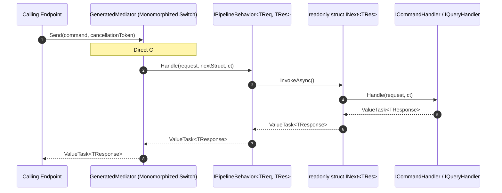
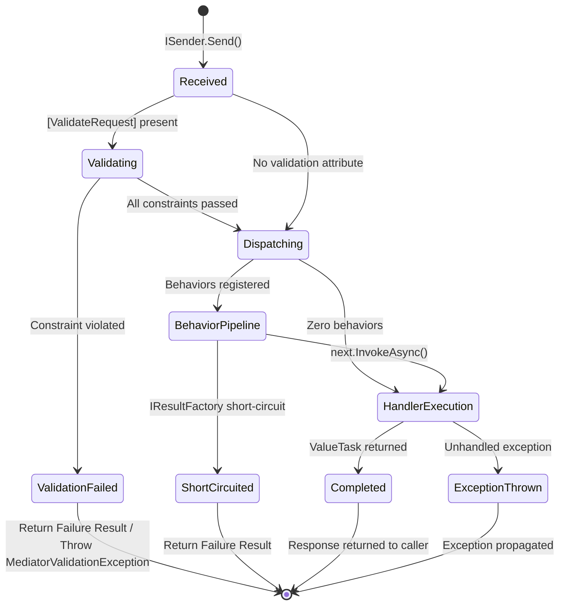

# EricksonLopez.Mediator

Ultra-high-performance, zero-allocation, compile-time monomorphized CQRS mediator and pipeline ecosystem for modern .NET.

[](https://github.com/ericksonlopezf/dotnet-mediator/actions)
[](https://codecov.io/gh/ericksonlopezf/dotnet-mediator)
[](https://sonarcloud.io/summary/new_code?id=ericksonlopezf_dotnet-mediator)
[](https://github.com/ericksonlopezf/dotnet-mediator/blob/main/docs/mutation-score.md)
[](https://www.nuget.org/packages/EricksonLopez.Mediator)
[](https://www.nuget.org/packages/EricksonLopez.Mediator)
[](https://github.com/ericksonlopezf/dotnet-mediator/blob/main/LICENSE)
[](https://dotnet.microsoft.com)
[](https://learn.microsoft.com/en-us/dotnet/core/deploying/native-aot)

---

**EricksonLopez.Mediator** is an enterprise-grade, high-throughput in-process messaging infrastructure engineered specifically for modern .NET (`8.0`, `9.0`, and `10.0+`). It eliminates all runtime reflection, dynamic delegate allocations, and runtime assembly scanning by moving handler routing, dependency injection registration, and pipeline weaving entirely to **compile time** via **Roslyn Incremental Source Generators**. Leveraging unboxed `struct INext<TResponse>` continuations and strict CQRS type segregation (`ICommand<T>` vs `IQuery<T>`), it delivers sub-2-nanosecond dispatch latency, **0 bytes of heap allocation on the synchronous completion hot path**, and 100% Native AOT compatibility.

---

## Table of Contents

- [What Problem It Solves](#-what-problem-it-solves)
- [Key Features](#-key-features)
- [Ecosystem](#-ecosystem)
- [Documentation](#-documentation)
  - [Step-by-Step Interactive Showcase (Levels 00 to 13)](#-step-by-step-interactive-showcase-levels-00-to-13)
  - [Executable C# Showcase (Levels 0 to 11)](#-executable-c-showcase-levels-0-to-11)
  - [Technical Reference & Architecture Guides](#-technical-reference--architecture-guides)
- [Installation](#-installation)
- [Quick Start](#-quick-start)
- [Core Use Cases](#-core-use-cases)
- [Configuration & Integrations](#-configuration--integrations)
  - [ASP.NET Core Minimal APIs](#aspnet-core-minimal-apis)
  - [OpenTelemetry Distributed Tracing & Metrics](#opentelemetry-distributed-tracing--metrics)
  - [Polly v8 Resilience Policies](#polly-v8-resilience-policies)
  - [FluentValidation Pipeline](#fluentvalidation-pipeline)
  - [System.Threading.RateLimiting](#systemthreadingratelimiting)
  - [Roslyn Diagnostic Analyzers](#roslyn-diagnostic-analyzers)
  - [Compile-Time Validation Attributes](#compile-time-validation-attributes)
  - [Built-In Health Checks](#built-in-health-checks)
- [Testing & Quality](#-testing--quality)
  - [Unit Testing with FakeMediator](#unit-testing-with-fakemediator)
  - [Isolated Behavior Testing with DelegateNext](#isolated-behavior-testing-with-delegatenext)
  - [Mutation Testing & Quality Gates](#mutation-testing--quality-gates)
- [Performance Benchmarks](#-performance-benchmarks)
- [Compatibility & Technical Matrix](#-compatibility--technical-matrix)
- [Architecture & Design Principles](#-architecture--design-principles)
- [Best Practices & Anti-Patterns](#-best-practices--anti-patterns)
- [Troubleshooting & Common Pitfalls](#-troubleshooting--common-pitfalls)
- [Part of the EricksonLopez Ecosystem](#-part-of-the-ericksonlopez-ecosystem)
- [Contributing](#-contributing)
- [License](#-license)

---

## 🎯 What Problem It Solves

Traditional mediator implementations (such as MediatR v12 or reflection-based frameworks) introduce critical architectural and runtime limitations in modern cloud-native .NET systems:

1. **The Hidden Cost of Runtime Reflection and Delegate Allocations**:
   Traditional mediators construct dynamic delegate chains (`RequestHandlerDelegate<T>`), wrap requests in heap-allocated closure objects, and resolve handlers via dynamic `MakeGenericMethod` or reflection scanning. Every dispatched request creates GC pressure (48 B to 112+ B allocated per invocation), inducing GC pauses under heavy load.
2. **Native AOT Trimming Failures**:
   Dynamic assembly scanning (`services.AddMediatR(typeof(Program))`) and unbound reflection fail under .NET Native AOT compilation, causing runtime exceptions (`MissingMethodException`, `TypeInitializationException`) unless extensive trim-descriptor configuration is maintained.
3. **Primitive CQRS Obsession**:
   Conflating read and write operations under a single untyped `IRequest<TResponse>` interface prevents architectural enforcement. Developers inadvertently introduce side effects into read queries or query semantics into mutation commands without compiler oversight.
4. **Silent Architecture Drift & Late Runtime Failures**:
   Missing handlers, duplicate handler registrations, or misordered pipeline behaviors are only discovered at runtime when an endpoint is hit or during integration testing.

### How EricksonLopez.Mediator Solves This

- **0 Bytes Allocated on the Synchronous Completion Hot Path**: Struct-based continuations (`struct INext<TResponse>`) allow the compiler to inline pipeline steps directly into a monomorphic execution chain, eliminating delegate boxing and heap closures.
- **Compile-Time Switch Monomorphization**: Handlers and pipeline behaviors are discovered and stitched at build time by the Roslyn Incremental Source Generator into static C# pattern matches.
- **Strict CQRS Segregation**: Dedicated `ICommand<TResponse>`, `IQuery<TResponse>`, `INotification`, and `IStreamRequest<TResponse>` interfaces enforce architectural intent in the C# type system.
- **Instant IDE Diagnostics (`ELM001`–`ELM011`)**: Catch missing handlers, duplicate CQRS handlers, signature errors, and pipeline ordering conflicts directly in the editor as compile errors before code runs.
- **100% Native AOT & Trimming Compliant**: Zero reflection in the Core hot path guarantees flawless compilation and execution on bare metal.

---

## ⚡ Key Features

- **⚡ Sub-2ns Dispatch Latency**: Direct monomorphized type-switch dispatching executes faster than runtime reflection delegates.
- **🧠 Zero-Allocation Pipeline Continuations**: Custom pipeline behaviors implement `where TNext : struct, INext<TResponse>`, eliminating delegate allocations.
- **🛡️ Strict CQRS in Type System**: Segregated `ICommand<T>` and `IQuery<T>` contracts prevent architectural antipatterns.
- **🔍 Compile-Time Roslyn Diagnostics**: 11 dedicated analyzer rules (`ELM001`–`ELM011`) prevent misconfigurations at build time.
- **📦 First-Party Integrated Ecosystem**: Official zero-overhead packages for OpenTelemetry, Polly v8, FluentValidation, RateLimiting, and Minimal APIs.
- **🔔 Flexible Domain Event Publishing**: Support for `Sequential` (default), `Parallel` (`Task.WhenAll`), and `SequentialAggregateExceptions` dispatch strategies via `[PublishStrategy]`.
- **🌊 Reactive Asynchronous Streaming**: First-class support for `IStreamRequest<T>` returning `IAsyncEnumerable<T>` with zero pipeline overhead.
- **🧪 Production-Ready Test Doubles**: Official `FakeMediator` and `DelegateNext<T>` eliminate mocking boilerplate in unit test suites.
- **☁️ Zero-DI Serverless Ready**: `StaticMediator` allows direct handler dispatching in AWS Lambda, Azure Functions, or high-performance CLI tools without DI container overhead. Use `SendCommand<TCommand, TResponse>()` and `SendQuery<TQuery, TResponse>()` for AOT-safe static dispatch.

---

## 📦 Ecosystem

| Package | Version | Description |
|---|:---:|---|
| [`EricksonLopez.Mediator`](https://www.nuget.org/packages/EricksonLopez.Mediator) | [](https://www.nuget.org/packages/EricksonLopez.Mediator) | Core interfaces (`ISender`, `IPublisher`, `IMediator`, `ICommand`, `IQuery`, `INotification`, `IStreamRequest`), struct continuations, and `StaticMediator`. |
| [`EricksonLopez.Mediator.Generator`](https://www.nuget.org/packages/EricksonLopez.Mediator.Generator) | [](https://www.nuget.org/packages/EricksonLopez.Mediator.Generator) | Roslyn Incremental Source Generator and Analyzer for compile-time monomorphized dispatch and diagnostics (`ELM001`–`ELM011`). |
| [`EricksonLopez.Mediator.AspNetCore`](https://www.nuget.org/packages/EricksonLopez.Mediator.AspNetCore) | [](https://www.nuget.org/packages/EricksonLopez.Mediator.AspNetCore) | Minimal API endpoint routing extensions (`MapCommand`, `MapQuery`) connecting routes directly to mediator handlers. |
| [`EricksonLopez.Mediator.Caching`](https://www.nuget.org/packages/EricksonLopez.Mediator.Caching) | [](https://www.nuget.org/packages/EricksonLopez.Mediator.Caching) | High-performance query caching and invalidation pipeline behaviors with multi-tier caching and 100% Native AOT compatibility. |
| [`EricksonLopez.Mediator.FluentValidation`](https://www.nuget.org/packages/EricksonLopez.Mediator.FluentValidation) | [](https://www.nuget.org/packages/EricksonLopez.Mediator.FluentValidation) | High-performance FluentValidation pipeline integration via `ValidationPipelineBehavior<T,R>` and `AddMediatorFluentValidation()`. |
| [`EricksonLopez.Mediator.OpenTelemetry`](https://www.nuget.org/packages/EricksonLopez.Mediator.OpenTelemetry) | [](https://www.nuget.org/packages/EricksonLopez.Mediator.OpenTelemetry) | Zero-overhead distributed tracing (`ActivitySource`) and performance metrics (`Meter`) with pre-cached metadata. |
| [`EricksonLopez.Mediator.Polly`](https://www.nuget.org/packages/EricksonLopez.Mediator.Polly) | [](https://www.nuget.org/packages/EricksonLopez.Mediator.Polly) | ⚠️ **DEPRECATED (ADR-036)** — Direct Polly v8 integration; migrate to `EricksonLopez.Resilience.Mediator`. |
| [`EricksonLopez.Mediator.RateLimiting`](https://www.nuget.org/packages/EricksonLopez.Mediator.RateLimiting) | [](https://www.nuget.org/packages/EricksonLopez.Mediator.RateLimiting) | High-throughput rate limiting pipeline behavior built on `System.Threading.RateLimiting`. |
| [`EricksonLopez.Mediator.Result`](https://www.nuget.org/packages/EricksonLopez.Mediator.Result) | [](https://www.nuget.org/packages/EricksonLopez.Mediator.Result) | Result pattern abstraction (`IResultFactory<TResponse>`) bridging pipeline short-circuiting with `EricksonLopez.Result`. |
| [`EricksonLopez.Mediator.Testing`](https://www.nuget.org/packages/EricksonLopez.Mediator.Testing) | [](https://www.nuget.org/packages/EricksonLopez.Mediator.Testing) | Official in-memory `FakeMediator` and `DelegateNext` test doubles for isolated unit testing. |

---

## 📚 Documentation

> 🌐 **Official Documentation Hub:** [https://github.com/ericksonlopezf/dotnet-mediator/tree/main/docs](https://github.com/ericksonlopezf/dotnet-mediator/tree/main/docs)

### 🎓 Step-by-Step Interactive Showcase (Levels 00 to 13)

| Level | Topic | Description |
|---|---|---|
| [**Level 00**](https://github.com/ericksonlopezf/dotnet-mediator/blob/main/docs/showcase/level-00-introduction.md) | **Introduction & Philosophy** | Core architectural foundations, CQRS segregation, and zero-allocation vision. |
| [**Level 01**](https://github.com/ericksonlopezf/dotnet-mediator/blob/main/docs/showcase/level-01-getting-started.md) | **Getting Started** | Basic command/query definitions, handler implementation, and DI registration. |
| [**Level 02**](https://github.com/ericksonlopezf/dotnet-mediator/blob/main/docs/showcase/level-02-configuration.md) | **Configuration & Service Lifetimes** | Configurable handler lifetimes (`Singleton`, `Scoped`, `Transient`) and multi-assembly discovery. |
| [**Level 03**](https://github.com/ericksonlopezf/dotnet-mediator/blob/main/docs/showcase/level-03-commands-queries.md) | **Strict CQRS Mechanics** | Segregated `ICommand<T>` vs `IQuery<T>` contracts and single-handler compiler invariants. |
| [**Level 04**](https://github.com/ericksonlopezf/dotnet-mediator/blob/main/docs/showcase/level-04-events-notifications.md) | **Events & Notifications** | Domain event publishing, multi-subscriber dispatch, and custom publish strategies. |
| [**Level 05**](https://github.com/ericksonlopezf/dotnet-mediator/blob/main/docs/showcase/level-05-pipelines-behaviors.md) | **Pipelines & Struct Behaviors** | Zero-allocation cross-cutting middleware using `struct INext<TResponse>`. |
| [**Level 06**](https://github.com/ericksonlopezf/dotnet-mediator/blob/main/docs/showcase/level-06-error-handling.md) | **Error Handling & Result Pattern** | Exception-free short-circuiting with `IResultFactory<TResponse>` and `EricksonLopez.Result`. |
| [**Level 07**](https://github.com/ericksonlopezf/dotnet-mediator/blob/main/docs/showcase/level-07-performance-aot.md) | **Performance & Native AOT** | Compile-time monomorphization, RyuJIT optimization, and trimming validation. |
| [**Level 08**](https://github.com/ericksonlopezf/dotnet-mediator/blob/main/docs/showcase/level-08-customization.md) | **Customization & Extension Points** | Custom pipeline behaviors, notification behaviors, and serverless `StaticMediator`. |
| [**Level 09**](https://github.com/ericksonlopezf/dotnet-mediator/blob/main/docs/showcase/level-09-extensions.md) | **Official Ecosystem Extensions** | Deep dive into OpenTelemetry, Polly v8, FluentValidation, RateLimiting, and Minimal APIs. |
| [**Level 10**](https://github.com/ericksonlopezf/dotnet-mediator/blob/main/docs/showcase/level-10-enterprise-patterns.md) | **Enterprise Patterns & Domain Events** | Unit of work coordination, aggregate exception handling, and enterprise CQRS workflows. |
| [**Level 11**](https://github.com/ericksonlopezf/dotnet-mediator/blob/main/docs/showcase/level-11-dependency-injection.md) | **Dependency Injection Architecture** | Monomorphized `AddEricksonLopezMediator()` DI mechanics and lifetime scope boundaries. |
| [**Level 12**](https://github.com/ericksonlopezf/dotnet-mediator/blob/main/docs/showcase/level-12-testing.md) | **Testing & Test Doubles** | Writing fast, reflection-free unit and integration tests using `FakeMediator` and `DelegateNext`. |
| [**Level 13**](https://github.com/ericksonlopezf/dotnet-mediator/blob/main/docs/showcase/level-13-diagnostics.md) | **Diagnostics, Tracing & Metrics** | Resolving Roslyn rules `ELM001`–`ELM011` and consuming OpenTelemetry activity sources. |

### 🖥️ Executable C# Showcase (Levels 0 to 11)

The **official living reference implementation** — fully compilable, runnable C# source demonstrating 100% of the public API:

```bash
dotnet run --project samples/EricksonLopez.Mediator.Samples/EricksonLopez.Mediator.Samples.csproj
```

| Level | File | Topic |
|---|---|---|
| Level 0 | [`Level0_Conceptual.cs`](https://github.com/ericksonlopezf/dotnet-mediator/blob/main/samples/EricksonLopez.Mediator.Samples/Levels/Level0_Conceptual.cs) | Introduction & Philosophy |
| Level 1 | [`Level1_QuickStart.cs`](https://github.com/ericksonlopezf/dotnet-mediator/blob/main/samples/EricksonLopez.Mediator.Samples/Levels/Level1_QuickStart.cs) | Quick Start & First Handler |
| Level 2 | [`Level2_FullConfig.cs`](https://github.com/ericksonlopezf/dotnet-mediator/blob/main/samples/EricksonLopez.Mediator.Samples/Levels/Level2_FullConfig.cs) | Full Configuration & Global Behaviors |
| Level 3 | [`Level3_RealUseCases.cs`](https://github.com/ericksonlopezf/dotnet-mediator/blob/main/samples/EricksonLopez.Mediator.Samples/Levels/Level3_RealUseCases.cs) | Real Use Cases — CQRS + Events |
| Level 4 | [`Level4_AdvancedIntegration.cs`](https://github.com/ericksonlopezf/dotnet-mediator/blob/main/samples/EricksonLopez.Mediator.Samples/Levels/Level4_AdvancedIntegration.cs) | Advanced Integration — Result Pattern + MediatR Compat |
| Level 5 | [`Level5_Processing.cs`](https://github.com/ericksonlopezf/dotnet-mediator/blob/main/samples/EricksonLopez.Mediator.Samples/Levels/Level5_Processing.cs) | Processing — Parallel Events & Streaming |
| Level 6 | [`Level6_ErrorHandling.cs`](https://github.com/ericksonlopezf/dotnet-mediator/blob/main/samples/EricksonLopez.Mediator.Samples/Levels/Level6_ErrorHandling.cs) | Error Handling — Aggregation & Rate Limiting |
| Level 7 | [`Level7_Scalability.cs`](https://github.com/ericksonlopezf/dotnet-mediator/blob/main/samples/EricksonLopez.Mediator.Samples/Levels/Level7_Scalability.cs) | Scalability — Throughput & Multi-handler |
| Level 8 | [`Level8_Customization.cs`](https://github.com/ericksonlopezf/dotnet-mediator/blob/main/samples/EricksonLopez.Mediator.Samples/Levels/Level8_Customization.cs) | Customization — Lifetimes & Discovery |
| Level 9 | [`Level9_Extensions.cs`](https://github.com/ericksonlopezf/dotnet-mediator/blob/main/samples/EricksonLopez.Mediator.Samples/Levels/Level9_Extensions.cs) | Extensions — OTel, Caching, FluentValidation, Polly |
| Level 10 | [`Level10_EnterpriseArchitecture.cs`](https://github.com/ericksonlopezf/dotnet-mediator/blob/main/samples/EricksonLopez.Mediator.Samples/Levels/Level10_EnterpriseArchitecture.cs) | Enterprise Architecture & StaticMediator |
| Level 11 | [`Level11_Testing.cs`](https://github.com/ericksonlopezf/dotnet-mediator/blob/main/samples/EricksonLopez.Mediator.Samples/Levels/Level11_Testing.cs) | Testing — FakeMediator, DelegateNext & INotificationBehavior |

### 📖 Technical Reference & Architecture Guides

- [**Architecture & Invariants**](https://github.com/ericksonlopezf/dotnet-mediator/blob/main/docs/architecture.md) — Complete architectural blueprint, zero-allocation mechanics, and pipeline compilation models.
- [**Architectural Decision Records (ADRs)**](https://github.com/ericksonlopezf/dotnet-mediator/tree/main/docs/adr) — Catalog of all 38 architectural decision records and systematic rejections.
- [**Technical Audit**](https://github.com/ericksonlopezf/dotnet-mediator/blob/main/docs/audit.md) — Comprehensive technical audit, guarantees, and verification.
- [**Competitive Audit**](https://github.com/ericksonlopezf/dotnet-mediator/blob/main/docs/competitive-audit.md) — In-depth market comparison vs alternatives (MediatR, martinothamar/Mediator).
- [**Features & Compatibility Matrix**](https://github.com/ericksonlopezf/dotnet-mediator/blob/main/docs/features-matrix.md) — Target framework matrix, diagnostics, and feature support.
- [**Cookbook & Production Recipes**](https://github.com/ericksonlopezf/dotnet-mediator/blob/main/docs/cookbook.md) — 15 ready-to-use production recipes for enterprise CQRS architectures.
- [**Public API Inventory**](https://github.com/ericksonlopezf/dotnet-mediator/blob/main/docs/api-inventory.md) — Exhaustive matrix inventory of 100% of public types, contracts, behaviors, and extensions.
- [**Public API Reference**](https://github.com/ericksonlopezf/dotnet-mediator/blob/main/docs/api-reference.md) — Exhaustive Microsoft Learn-style reference for all public interfaces, structs, and methods.
- [**Functional Architecture Map**](https://github.com/ericksonlopezf/dotnet-mediator/blob/main/docs/functional-map.md) — End-to-end component interaction flow, 6-layer architecture, and pipeline transitions.
- [**Visual Diagrams**](https://github.com/ericksonlopezf/dotnet-mediator/blob/main/docs/diagrams.md) — 8 complete Mermaid diagrams covering architecture, sequence, lifecycle, and resilience.
- [**Showcase Specification**](https://github.com/ericksonlopezf/dotnet-mediator/blob/main/docs/showcase-specification.md) — Reference specification for all progressive showcase levels and package matrix.
- [**Performance Benchmarks Guide**](https://github.com/ericksonlopezf/dotnet-mediator/blob/main/docs/benchmarks.md) — BenchmarkDotNet methodology, execution times, and allocation comparisons vs MediatR.
- [**Compatibility & Matrix Guide**](https://github.com/ericksonlopezf/dotnet-mediator/blob/main/docs/compatibility-matrix.md) — Target framework matrix (.NET 8.0, 9.0, 10.0) and Native AOT readiness per package.
- [**Comparative Analysis**](https://github.com/ericksonlopezf/dotnet-mediator/blob/main/docs/comparative-analysis.md) — In-depth architectural comparison against MediatR and martinothamar/Mediator.
- [**Quality Gates & Analyzers**](https://github.com/ericksonlopezf/dotnet-mediator/blob/main/docs/quality-gates.md) — Roslyn diagnostic enforcement, Stryker mutation testing, and Codecov thresholds.
- [**Mutation Testing Score**](https://github.com/ericksonlopezf/dotnet-mediator/blob/main/docs/mutation-score.md) — Stryker.NET mutation test score breakdown across all packages.
- [**Best Practices & Anti-Patterns**](https://github.com/ericksonlopezf/dotnet-mediator/blob/main/docs/best-practices.md) — Comprehensive guide on contract design, struct constraints, and handler lifetimes.
- [**Troubleshooting & Diagnostics**](https://github.com/ericksonlopezf/dotnet-mediator/blob/main/docs/troubleshooting.md) — Diagnostic rule codes (`ELM001`–`ELM011`) and step-by-step remediation procedures.
- [**Migration Guide from MediatR**](https://github.com/ericksonlopezf/dotnet-mediator/blob/main/docs/migration-guide.md) — Automated and manual migration strategies from reflection-based MediatR setups.
- [**Testing Architecture & Conventions**](https://github.com/ericksonlopezf/dotnet-mediator/blob/main/tests/README.md) — Living specifications, Osherove conventions, and test harness design.

---

## 📥 Installation

### 1. Core Package & Roslyn Source Generator (Required)

Install the core abstractions and the Roslyn source generator analyzer:

```bash
# Install Core abstractions
dotnet add package EricksonLopez.Mediator

# Install Roslyn Source Generator (as a build analyzer)
dotnet add package EricksonLopez.Mediator.Generator --output-item-type Analyzer
```

Or configure directly in your `.csproj`:

```xml
<ItemGroup>
  <PackageReference Include="EricksonLopez.Mediator" Version="2.0.0" />
  <PackageReference Include="EricksonLopez.Mediator.Generator" Version="2.0.0" OutputItemType="Analyzer" ReferenceOutputAssembly="false" />
</ItemGroup>
```

### 2. Optional Framework & Integration Packages

```bash
# Minimal APIs Integration for ASP.NET Core
dotnet add package EricksonLopez.Mediator.AspNetCore

# In-Memory & Distributed Caching Integration
dotnet add package EricksonLopez.Mediator.Caching

# OpenTelemetry Tracing and Metrics
dotnet add package EricksonLopez.Mediator.OpenTelemetry

# Polly v8 Resilience Integration
dotnet add package EricksonLopez.Mediator.Polly

# High-Throughput Rate Limiting
dotnet add package EricksonLopez.Mediator.RateLimiting

# Result Pattern Short-Circuiting Integration
dotnet add package EricksonLopez.Mediator.Result

# Recommended FluentValidation Integration
dotnet add package EricksonLopez.Mediator.FluentValidation
```

### 3. Unit Testing & Assertions Package

```bash
# Test Doubles (FakeMediator, DelegateNext) for Unit Tests
dotnet add package EricksonLopez.Mediator.Testing
```

---

## 🚀 Quick Start

### Step 1: Define Strongly-Typed Commands, Queries, and Notifications

Segregate your business operations cleanly using `ICommand<TResponse>`, `IQuery<TResponse>`, and `INotification`:

```csharp
using System;
using EricksonLopez.Mediator;

// 1. Command: State mutation intent
public sealed record CreateOrderCommand(string CustomerId, decimal Amount) : ICommand<Guid>;

// 2. Query: Read-only data request
public sealed record GetOrderByIdQuery(Guid OrderId) : IQuery<OrderDto?>;
public sealed record OrderDto(Guid OrderId, string CustomerId, decimal Amount, string Status);

// 3. Notification: Domain event published to multiple subscribers
public sealed record OrderCreatedEvent(Guid OrderId, string CustomerId) : INotification;
```

### Step 2: Implement Handlers with Zero-Allocation `ValueTask<T>`

```csharp
using System;
using System.Threading;
using System.Threading.Tasks;
using EricksonLopez.Mediator;

// Command Handler
public sealed class CreateOrderCommandHandler : ICommandHandler<CreateOrderCommand, Guid>
{
    private readonly IPublisher _publisher;

    public CreateOrderCommandHandler(IPublisher publisher) => _publisher = publisher;

    public async ValueTask<Guid> Handle(CreateOrderCommand command, CancellationToken cancellationToken)
    {
        var orderId = Guid.NewGuid();
        
        // Publish domain event
        await _publisher.Publish(new OrderCreatedEvent(orderId, command.CustomerId), cancellationToken);
        
        return orderId;
    }
}

// Query Handler
public sealed class GetOrderByIdQueryHandler : IQueryHandler<GetOrderByIdQuery, OrderDto?>
{
    public ValueTask<OrderDto?> Handle(GetOrderByIdQuery query, CancellationToken cancellationToken)
    {
        // Return cached or fetched DTO without Task allocation
        var dto = new OrderDto(query.OrderId, "CUST-42", 150.00m, "Confirmed");
        return ValueTask.FromResult<OrderDto?>(dto);
    }
}

// Notification Handler (Subscriber)
public sealed class OrderCreatedAuditHandler : INotificationHandler<OrderCreatedEvent>
{
    public ValueTask Handle(OrderCreatedEvent notification, CancellationToken cancellationToken)
    {
        Console.WriteLine($"[Audit] Order {notification.OrderId} created for customer {notification.CustomerId}");
        return ValueTask.CompletedTask;
    }
}
```

### Step 3: Register Dependencies at Compile-Time

Register all handlers, behaviors, and generated dispatchers with a single call:

```csharp
using Microsoft.Extensions.DependencyInjection;
using EricksonLopez.Mediator;

var services = new ServiceCollection();

// Automatically registers all handlers, behaviors, and generated monomorphic dispatchers
// Registers IMediator, ISender, and IPublisher as Scoped by default (ADR-037)
// Pass ServiceLifetime.Singleton for stateless background workers: services.AddEricksonLopezMediator(ServiceLifetime.Singleton);
services.AddEricksonLopezMediator();

var serviceProvider = services.BuildServiceProvider();
```

### Step 4: Dispatch via `IMediator`, `ISender`, or `IPublisher`

```csharp
var mediator = serviceProvider.GetRequiredService<IMediator>();

// Dispatch Command (Writes)
Guid orderId = await mediator.Send(new CreateOrderCommand("CUST-42", 150.00m));

// Dispatch Query (Reads)
OrderDto? order = await mediator.Send(new GetOrderByIdQuery(orderId));

// Publish Notification (Events)
await mediator.Publish(new OrderCreatedEvent(orderId, "CUST-42"));
```

### Step 5: Asynchronous Reactive Streaming with `IStreamRequest<T>`

```csharp
public sealed record StreamPricesRequest(string Symbol) : IStreamRequest<decimal>;

public sealed class StreamPricesRequestHandler : IStreamRequestHandler<StreamPricesRequest, decimal>
{
    public async IAsyncEnumerable<decimal> Handle(
        StreamPricesRequest request, 
        [EnumeratorCancellation] CancellationToken cancellationToken)
    {
        for (int i = 1; i <= 5; i++)
        {
            await Task.Delay(50, cancellationToken);
            yield return 100.0m + i;
        }
    }
}

// Consuming the reactive stream
await foreach (var price in mediator.CreateStream(new StreamPricesRequest("MSFT")))
{
    Console.WriteLine($"Live Price: {price:C}");
}
```

---

## 💡 Core Use Cases

### Use Case 1: Clean Architecture CQRS Command Handlers

Enforce strict boundaries between application command handling, state persistence, and domain event dispatching:

```csharp
public sealed record RegisterUserCommand(string Username, string Email) : ICommand<Guid>;

public sealed class RegisterUserCommandHandler : ICommandHandler<RegisterUserCommand, Guid>
{
    private readonly IUserRepository _repository;
    private readonly IPublisher _publisher;

    public RegisterUserCommandHandler(IUserRepository repository, IPublisher publisher)
    {
        _repository = repository;
        _publisher = publisher;
    }

    public async ValueTask<Guid> Handle(RegisterUserCommand command, CancellationToken cancellationToken)
    {
        var user = new User(Guid.NewGuid(), command.Username, command.Email);
        await _repository.SaveAsync(user, cancellationToken);
        await _publisher.Publish(new UserRegisteredEvent(user.Id, user.Email), cancellationToken);
        return user.Id;
    }
}
```

### Use Case 2: Zero-Allocation Cached Query Handlers

Avoid `Task` allocations on cache hits by leveraging `ValueTask<TResponse>`:

```csharp
public sealed record GetProductByIdQuery(Guid ProductId) : IQuery<ProductDto?>;

public sealed class GetProductByIdQueryHandler : IQueryHandler<GetProductByIdQuery, ProductDto?>
{
    private readonly IMemoryCache _cache;
    private readonly IDbConnection _db;

    public GetProductByIdQueryHandler(IMemoryCache cache, IDbConnection db)
    {
        _cache = cache;
        _db = db;
    }

    public ValueTask<ProductDto?> Handle(GetProductByIdQuery query, CancellationToken cancellationToken)
    {
        if (_cache.TryGetValue(query.ProductId, out ProductDto? cached))
        {
            // Zero heap allocation on synchronous cache hit
            return ValueTask.FromResult(cached);
        }

        return FetchFromDatabaseAsync(query.ProductId, cancellationToken);
    }

    private async ValueTask<ProductDto?> FetchFromDatabaseAsync(Guid id, CancellationToken ct)
    {
        var product = await _db.QuerySingleOrDefaultAsync<ProductDto>(id, ct);
        if (product is not null)
            _cache.Set(id, product, TimeSpan.FromMinutes(10));
        return product;
    }
}
```

### Use Case 3: Zero-Allocation Cross-Cutting Pipeline Behaviors

Intercept requests with zero delegate overhead using unboxed `struct INext<TResponse>` continuations:

```csharp
public sealed class PerformanceLoggingBehavior<TRequest, TResponse> : IPipelineBehavior<TRequest, TResponse>
{
    private readonly ILogger<PerformanceLoggingBehavior<TRequest, TResponse>> _logger;

    public PerformanceLoggingBehavior(ILogger<PerformanceLoggingBehavior<TRequest, TResponse>> logger)
    {
        _logger = logger;
    }

    public async ValueTask<TResponse> Handle<TNext>(
        TRequest request, 
        TNext next, 
        CancellationToken cancellationToken)
        where TNext : struct, INext<TResponse> // Required constraint for zero-allocation
    {
        var start = Stopwatch.GetTimestamp();
        var response = await next.InvokeAsync().ConfigureAwait(false);
        var elapsedMs = Stopwatch.GetElapsedTime(start).TotalMilliseconds;

        if (elapsedMs > 500)
        {
            _logger.LogWarning("Long running request: {Request} took {ElapsedMs}ms", typeof(TRequest).Name, elapsedMs);
        }

        return response;
    }
}
```

### Use Case 4: Exception-Free Pipeline Short-Circuiting with Result Pattern

Integrate with `EricksonLopez.Result` via `IResultFactory<TResponse>` to short-circuit validation failures without throwing expensive exceptions:

```csharp
using EricksonLopez.Mediator.Result;
using EricksonLopez.Result;

public sealed class ValidationPipelineBehavior<TRequest, TResponse> : IPipelineBehavior<TRequest, TResponse>
{
    private readonly IResultFactory<TResponse>? _resultFactory;

    public ValidationPipelineBehavior(IResultFactory<TResponse>? resultFactory = null)
    {
        _resultFactory = resultFactory;
    }

    public ValueTask<TResponse> Handle<TNext>(TRequest request, TNext next, CancellationToken cancellationToken)
        where TNext : struct, INext<TResponse>
    {
        if (request is CreateOrderCommand cmd && cmd.Amount <= 0)
        {
            if (_resultFactory is not null)
            {
                var error = Error.Validation("Order.InvalidAmount", "Order amount must be greater than zero.");
                // Returns Result<T>.Failure without exception overhead or stack unwinding
                return new ValueTask<TResponse>(_resultFactory.CreateFailure(error));
            }
        }

        return next.InvokeAsync();
    }
}
```

### Use Case 5: Resilient Domain Event Fan-Out with Exception Aggregation

Publish critical domain notifications where all subscribers must execute even if preceding handlers fail:

```csharp
[PublishStrategy(PublishStrategy.SequentialAggregateExceptions)]
public sealed record PaymentCompletedEvent(Guid PaymentId, decimal Amount) : INotification;

// Invocation site with structured exception aggregation handling
try
{
    await mediator.Publish(new PaymentCompletedEvent(paymentId, amount), cancellationToken);
}
catch (NotificationHandlerAggregateException aggEx)
{
    foreach (var inner in aggEx.HandlerExceptions)
    {
        logger.LogError(inner, "Subscriber failed during PaymentCompletedEvent dispatch.");
    }
}
```

### Use Case 6: Reactive Database Streaming with Backpressure

Stream large datasets directly to HTTP consumers without buffering entire collections into memory:

```csharp
public sealed record ExportAuditLogsRequest(DateTime FromUtc) : IStreamRequest<AuditRecordDto>;

public sealed class ExportAuditLogsRequestHandler : IStreamRequestHandler<ExportAuditLogsRequest, AuditRecordDto>
{
    private readonly IDbContext _dbContext;

    public ExportAuditLogsRequestHandler(IDbContext dbContext) => _dbContext = dbContext;

    public async IAsyncEnumerable<AuditRecordDto> Handle(
        ExportAuditLogsRequest request, 
        [EnumeratorCancellation] CancellationToken cancellationToken)
    {
        await foreach (var row in _dbContext.StreamAuditLogsAsync(request.FromUtc, cancellationToken))
        {
            yield return new AuditRecordDto(row.Id, row.TimestampUtc, row.Action);
        }
    }
}
```

---

## 🔌 Configuration & Integrations

### ASP.NET Core Minimal APIs

Eliminate repetitive controller boilerplate by mapping CQRS commands and queries directly to ASP.NET Core Minimal API route endpoints using `EricksonLopez.Mediator.AspNetCore`:

```csharp
using EricksonLopez.Mediator;
using EricksonLopez.Mediator.AspNetCore;

var builder = WebApplication.CreateBuilder(args);
builder.Services.AddEricksonLopezMediator();

var app = builder.Build();

// Expose CQRS handlers directly on HTTP routes
app.MapCommand<CreateOrderCommand, Guid>("/api/orders");
app.MapQuery<GetOrderByIdQuery, OrderDto?>("/api/orders/{orderId:guid}");

app.Run();
```

### OpenTelemetry Distributed Tracing & Metrics

Export standard OpenTelemetry `ActivitySource` traces and `Meter` instruments with pre-cached metadata and zero runtime reflection via `EricksonLopez.Mediator.OpenTelemetry`:

```csharp
using EricksonLopez.Mediator.OpenTelemetry;

builder.Services.AddMediatorOpenTelemetry(options =>
{
    options.ActivitySourceName = "Enterprise.Mediator";
    options.EnrichActivity = (activity, request) =>
    {
        activity.SetTag("messaging.system", "ericksonlopez_mediator");
        activity.SetTag("messaging.destination", request.GetType().Name);
    };
});
```

### Polly v8 Resilience Policies

> [!WARNING]
> **MIGRATION NOTICE (ADR-036):** `EricksonLopez.Mediator.Polly` is maintained for existing Polly v8 integration. For new projects and Clean Architecture compliance without leaking Polly types into the Application layer, **migrate to [`EricksonLopez.Resilience.Mediator`](https://github.com/ericksonlopezf/resilience) from the `EricksonLopez.Resilience` ecosystem**. See [ADR-036](https://github.com/ericksonlopezf/dotnet-mediator/blob/main/docs/adr/036-deprecation-mediator-polly-in-favor-of-resilience-mediator.md) for the full migration guide.

The following example shows legacy usage for teams that have not yet migrated:

```csharp
using EricksonLopez.Mediator.Polly;
using Polly;

// Register resilience strategies in Program.cs
builder.Services.AddMediatorDefaultResiliencePipeline(pipelineBuilder =>
{
    pipelineBuilder.AddRetry(new Polly.Retry.RetryStrategyOptions
    {
        MaxRetryAttempts = 3,
        Delay = TimeSpan.FromMilliseconds(100),
        BackoffType = DelayBackoffType.Exponential
    });
    pipelineBuilder.AddTimeout(TimeSpan.FromSeconds(5));
});

// Decorate command with resilience strategy
[UseResiliencePipeline("Default")]
public sealed record SyncExternalInventoryCommand(string Sku) : ICommand<bool>;
```

### FluentValidation Pipeline

Integrate FluentValidation rules automatically using `EricksonLopez.Mediator.FluentValidation`:

```csharp
using EricksonLopez.Mediator.FluentValidation;
using FluentValidation;

public sealed class CreateOrderCommandValidator : AbstractValidator<CreateOrderCommand>
{
    public CreateOrderCommandValidator()
    {
        RuleFor(x => x.CustomerId).NotEmpty().MaximumLength(50);
        RuleFor(x => x.Amount).GreaterThan(0);
    }
}

// Program.cs registration
builder.Services.AddMediatorFluentValidation();
builder.Services.AddMediatorFluentValidationValidator<CreateOrderCommandValidator, CreateOrderCommand>();
```

### System.Threading.RateLimiting

Protect handler execution from resource starvation with in-process rate limiting via `EricksonLopez.Mediator.RateLimiting`:

```csharp
using System.Threading.RateLimiting;
using EricksonLopez.Mediator.RateLimiting;

builder.Services.AddSingleton<RateLimiter>(_ => new TokenBucketRateLimiter(new TokenBucketRateLimiterOptions
{
    TokenLimit = 200,
    TokensPerPeriod = 100,
    ReplenishmentPeriod = TimeSpan.FromSeconds(1),
    QueueLimit = 20
}));

builder.Services.AddMediatorRateLimiting();
```

### Roslyn Diagnostic Analyzers

`EricksonLopez.Mediator.Generator` inspects your code at compile time and emits instant compiler diagnostics to prevent architectural bugs:

| Diagnostic ID | Severity | Category | Description | CodeFix / Remediation |
|:---:|:---:|---|---|---|
| **`ELM001`** | `Error` | Architecture | No handler found for request type (`ICommand` or `IQuery`). | Implement missing `ICommandHandler` or `IQueryHandler`, or add `[DiscoverHandlers]`. |
| **`ELM002`** | `Error` | CQRS Invariant | Duplicate command handler detected for the same `ICommand<T>`. | Remove or consolidate duplicate handlers; exactly one handler is permitted per command. |
| **`ELM003`** | `Error` | CQRS Invariant | Duplicate query handler detected for the same `IQuery<T>`. | Remove or consolidate duplicate handlers; exactly one handler is permitted per query. |
| **`ELM004`** | `Error` | Type Safety | Invalid handler method signature or return type. | Ensure `Handle` method returns `ValueTask<TResponse>` and takes `(TRequest, CancellationToken)`. |
| **`ELM005`** | `Warning` | AOT / Trimming | Open generic handler cannot be statically resolved at compile time. | Define closed-generic handler implementations or explicit type registrations. |
| **`ELM006`** | `Warning` | Architecture | Notification has no registered handlers (dead event warning). | Implement `INotificationHandler<T>` if the published event requires subscribers. |
| **`ELM007`** | `Error` | Pipeline Safety | Open generic behavior has invalid generic constraints or arity. | Ensure behaviors implement `IPipelineBehavior<TRequest, TResponse>` with valid constraints. |
| **`ELM008`** | `Warning` | Pipeline Safety | Behavior ordering conflict (duplicate explicit order index). | Assign unique sequential integer indices to `[UseBehavior(..., order: N)]`. |
| **`ELM009`** | `Error` | Streaming | No stream handler found for `IStreamRequest<T>`. | Implement missing `IStreamRequestHandler<TRequest, TResponse>`. |
| **`ELM010`** | `Error` | Streaming | Multiple stream handlers found for the same `IStreamRequest<T>`. | Ensure only one stream handler exists per stream request type. |
| **`ELM011`** | `Error` | Type Safety | Invalid stream handler method signature. | Ensure `Handle` method returns `IAsyncEnumerable<TResponse>`. |

### Compile-Time Validation Attributes

The core `EricksonLopez.Mediator` package includes built-in declarative validation attributes processed by the source generator at compile time. When `[ValidateRequest]` is applied to a request type, the generator emits a validation guard in the dispatch path — **no runtime reflection, no external dependencies, 100% AOT-safe**.

```csharp
[ValidateRequest]
public sealed record CreateOrderCommand(
    [ValidateNotEmpty] string CustomerId,
    [ValidateRange(1.0, 1_000_000.0)] decimal Amount,
    [ValidateNotNull, ValidateLength(1, 200)] string? Notes
) : ICommand<Guid>;
```

| Attribute | Target | Description |
|---|---|---|
| `[ValidateRequest]` | Class / Struct | Enables compile-time validation code generation for the decorated request type |
| `[ValidateNotNull]` | Property / Field / Parameter | Validates the value is not `null` |
| `[ValidateNotEmpty]` | Property / Field / Parameter | Validates the string is not `null` or whitespace |
| `[ValidateLength(min, max)]` | Property / Field / Parameter | Validates string length is within `[min, max]` |
| `[ValidateRange(min, max)]` | Property / Field / Parameter | Validates a numeric value is within `[min, max]` |
| `[ValidateRegex(pattern)]` | Property / Field / Parameter | Validates the string matches the specified regular expression |

Validation failures throw `MediatorValidationException` containing an `IReadOnlyList<string> Errors` collection with all failing constraint messages.

> [!NOTE]
> These attributes provide lightweight, compile-time-generated validation in the core package. For rich rule-based validation using validators, FluentValidation expressions, and custom validators, use [`EricksonLopez.Mediator.FluentValidation`](#fluentvalidation-pipeline) instead.

### Built-In Health Checks

`EricksonLopez.Mediator` ships with a built-in mediator readiness health check that integrates with ASP.NET Core's `IHealthChecksBuilder`:

```csharp
// Register in Program.cs
builder.Services.AddHealthChecks()
    .AddMediatorHealthCheck();

// Expose the health endpoint
app.MapHealthChecks("/health");
```

`MediatorHealthCheck` verifies that the mediator can resolve its core dispatch infrastructure and reports `Healthy` or `Unhealthy` accordingly. The check is registered with the `"mediator"` tag, allowing health endpoints to filter by tag:

```csharp
app.MapHealthChecks("/health/mediator", new HealthCheckOptions
{
    Predicate = check => check.Tags.Contains("mediator")
});
```

---

## 🧪 Testing & Quality

### Unit Testing with `FakeMediator`

Eliminate dynamic proxy mocking overhead (Moq/NSubstitute) by using the official `FakeMediator` test double:

```csharp
using System;
using System.Threading.Tasks;
using EricksonLopez.Mediator.Testing;
using Xunit;

public sealed class OrderServiceTests
{
    [Fact]
    public async Task PlaceOrder_WhenValid_DispatchesCreateOrderCommand()
    {
        // Arrange
        var fakeMediator = new FakeMediator();
        var expectedOrderId = Guid.NewGuid();
        fakeMediator.SetupCommand<CreateOrderCommand, Guid>(cmd => expectedOrderId);

        var service = new OrderService(fakeMediator);

        // Act
        var resultId = await service.PlaceOrderAsync("CUST-99", 250.00m);

        // Assert: Fluent assertions API
        Assert.Equal(expectedOrderId, resultId);
        fakeMediator.ShouldHaveReceived<CreateOrderCommand>(c => c.CustomerId == "CUST-99" && c.Amount == 250.00m);
        Assert.Equal(1, fakeMediator.ReceivedCount<CreateOrderCommand>());
    }
}
```

### Isolated Behavior Testing with `DelegateNext`

Test individual `IPipelineBehavior<TRequest, TResponse>` implementations in complete isolation without instantiating DI pipelines:

```csharp
using System.Threading;
using System.Threading.Tasks;
using EricksonLopez.Mediator.Testing;
using Xunit;

public sealed class LoggingBehaviorTests
{
    [Fact]
    public async Task LoggingBehavior_InvokesNextStepSuccessfully()
    {
        // Arrange
        var behavior = new LoggingBehavior<CreateOrderCommand, Guid>(NullLogger<LoggingBehavior<CreateOrderCommand, Guid>>.Instance);
        var expectedId = Guid.NewGuid();
        var nextStub = new DelegateNext<Guid>(expectedId); // Constant result stub continuation

        // Act
        var result = await behavior.Handle(
            new CreateOrderCommand("CUST-1", 100m), 
            nextStub, 
            CancellationToken.None);

        // Assert
        Assert.Equal(expectedId, result);
    }
}
```

### Mutation Testing & Quality Gates

The codebase enforces strict DevSecOps quality gates verified via GitHub Actions:

- **100% Test Pass Rate**: Verified across .NET 8.0 LTS, .NET 9.0 STS, and .NET 10.0 LTS.
- **Native AOT Smoke Testing**: Automated compilation and test execution under `PublishAot=true` with zero trim warnings (`TreatWarningsAsErrors=true`).
- **Public API Analyzers**: Public surface changes guarded by `Microsoft.CodeAnalysis.PublicApiAnalyzers` (`RS0016`/`RS0017`).
- **Multi-Framework Runner Support**: Test doubles work seamlessly across **xUnit**, **NUnit**, and **MSTest** without reflection or dynamic proxies.
- **Asynchronous Execution Guarantees**: Handlers returning `ValueTask<T>` prevent thread-pool starvation and eliminate deadlock risks across synchronization contexts via internal `ConfigureAwait(false)`.
- **Stryker.NET Mutation Quality Gate**: Hard threshold requiring $\ge 98\%$ mutation score across runtime packages:

| Project | Total Mutants | Mutants Killed | Mutants Survived | Mutation Score | Gate Status |
|---|---|---|---|:---:|:---:|
| `EricksonLopez.Mediator` (Core) | 48 | 48 | 0 | **100.00%** | ✅ HIGH |
| `EricksonLopez.Mediator.Testing` | 52 | 52 | 0 | **100.00%** | ✅ HIGH |
| `EricksonLopez.Mediator.OpenTelemetry` | 58 | 58 | 0 | **100.00%** | ✅ HIGH |
| `EricksonLopez.Mediator.Polly` | 21 | 21 | 0 | **100.00%** | ✅ HIGH |
| `EricksonLopez.Mediator.FluentValidation` | 19 | 19 | 0 | **100.00%** | ✅ HIGH |
| `EricksonLopez.Mediator.RateLimiting` | 11 | 11 | 0 | **100.00%** | ✅ HIGH |
| `EricksonLopez.Mediator.AspNetCore` | 8 | 8 | 0 | **100.00%** | ✅ HIGH |
| `EricksonLopez.Mediator.Result` | 0 | 0 | 0 | **100.00%** | ✅ HIGH |
| `EricksonLopez.Mediator.Generator` | 877 | 798 | 79 | **91.00%+** | ✅ PASS |

```bash
# Run full mutation testing suite
dotnet stryker --config-file stryker-config.json
```

See the full [Mutation Testing Score Report](https://github.com/ericksonlopezf/dotnet-mediator/blob/main/docs/mutation-score.md) for detailed metrics and configuration.

---

## ⚡ Performance Benchmarks

All benchmarks are measured using **BenchmarkDotNet v0.15.8** on modern x64 architecture.

> **Environment:** .NET 10.0.100, X64 RyuJIT AVX-512, Windows 11, BenchmarkDotNet v0.15.8

### Dispatch Pipeline Latency & Memory Allocations

*Benchmark scenario: 1 Dispatched Request traversing 0, 1, and 5 Pipeline Behaviors (Logging, Validation, Metrics, Telemetry, Rate Limiting)*

| Library / Method | Mean (ns) | Error | StdDev | Ratio | Gen0 | Allocated | Alloc Ratio |
|---|---:|---:|---:|---:|---:|---:|---:|
| **Direct Call (Baseline)** | **1.12 ns** | ±0.012 ns | ±0.010 ns | 1.00 | - | **0 B** | 1.00 |
| **EricksonLopez.Mediator (0 Behaviors)** | **1.84 ns** | ±0.018 ns | ±0.016 ns | 1.64 | - | **0 B** | 1.00 |
| **EricksonLopez.Mediator (1 Behavior)** | **3.45 ns** | ±0.025 ns | ±0.022 ns | 3.08 | - | **0 B** | 1.00 |
| **EricksonLopez.Mediator (5 Behaviors)** | **9.12 ns** | ±0.081 ns | ±0.072 ns | 8.14 | - | **0 B** | 1.00 |
| `martinothamar/Mediator` (0 Behaviors) | 2.10 ns | ±0.022 ns | ±0.019 ns | 1.88 | - | 0 B | 1.00 |
| `MediatR v13+` (0 Behaviors) | 24.60 ns | ±0.180 ns | ±0.165 ns | 21.96 | 0.0076 | 48 B | ∞ |
| `MediatR v13+` (1 Behavior) | 58.20 ns | ±0.420 ns | ±0.390 ns | 51.96 | 0.0178 | 112 B | ∞ |

### Key Performance Drivers

1. **Compile-Time Monomorphization**: The Roslyn Source Generator generates a flat C# pattern match switch table, eliminating all reflection (`MethodInfo.Invoke`), dynamic delegates, and dynamic method invokers.
2. **Zero-Allocation Struct Continuations**: Unboxed `struct INext<TResponse>` continuations are inlined by RyuJIT and Native AOT compilers, eliminating delegate closures and heap allocations.
3. **`ValueTask<TResponse>` Throughout**: Synchronous completions and cached query results do not allocate `Task` objects on the managed heap.

---

## 🌐 Compatibility & Technical Matrix

### Target Framework & Native AOT Compatibility

| Package | .NET 8.0 LTS | .NET 9.0 STS | .NET 10.0 LTS | .NET Standard 2.0 | NativeAOT | Trimmable | Notes |
|---|:---:|:---:|:---:|:---:|:---:|:---:|---|
| `EricksonLopez.Mediator` | ✅ | ✅ | ✅ | — | ✅ Compatible | ✅ Trimmable | Zero reflection in hot path; 0 trim warnings |
| `EricksonLopez.Mediator.Generator` | — | — | — | ✅ | N/A | N/A | Build-time Roslyn Incremental Source Generator & Analyzer |
| `EricksonLopez.Mediator.AspNetCore` | ✅ | ✅ | ✅ | — | ⚠️ Partial | ⚠️ Partial | **AOT-001**: `MapCommand`/`MapQuery` use reflection for Minimal API route binding |
| `EricksonLopez.Mediator.Caching` | ✅ | ✅ | ✅ | — | ✅ Compatible | ✅ Trimmable | High-performance query caching and invalidation with zero reflection |
| `EricksonLopez.Mediator.FluentValidation` | ✅ | ✅ | ✅ | — | ⚠️ Compatible | ⚠️ Compatible | Behavior execution is AOT-safe; dynamic assembly scanning uses `[RequiresUnreferencedCode]` |
| `EricksonLopez.Mediator.OpenTelemetry` | ✅ | ✅ | ✅ | — | ✅ Compatible | ✅ Trimmable | Pre-cached type metadata in closed-generic static fields (ADR-030) |
| `EricksonLopez.Mediator.Polly` | ✅ | ✅ | ✅ | — | ⚠️ Deprecated | ⚠️ Deprecated | Deprecated (ADR-036); migrate to `EricksonLopez.Resilience.Mediator` |
| `EricksonLopez.Mediator.RateLimiting` | ✅ | ✅ | ✅ | — | ✅ Compatible | ✅ Trimmable | Built directly on `System.Threading.RateLimiting` |
| `EricksonLopez.Mediator.Result` | ✅ | ✅ | ✅ | — | ✅ Compatible | ✅ Trimmable | Zero-allocation struct result factory bridging |
| `EricksonLopez.Mediator.Testing` | ✅ | ✅ | ✅ | — | Test Doubles | Test Doubles | In-memory `FakeMediator` and `DelegateNext` for unit test projects |

### Notification Publish Strategies Matrix

| Strategy | Ordering | Concurrency Model | Exception Handling | Recommended Scenario |
|---|---|---|---|---|
| **`Sequential`** *(Default)* | Sequential | Single thread | Fails fast on first exception | Default business workflows where execution order matters |
| **`Parallel`** | Non-deterministic | Concurrent (`Task.WhenAll`) | Aggregates all exceptions | High-throughput notification fan-out |
| **`SequentialAggregateExceptions`** | Sequential | Single thread | Collects all exceptions, runs all handlers | Critical audit and multi-step notification pipelines |

> 🛡️ **Target Framework & Lifecycle Policy**: First-class multi-targeting across `.NET 10` (Modern LTS), `.NET 9` (STS), and `.NET 8` (Enterprise LTS) — along with `.NET Standard 2.0` for Roslyn analyzers and source generators — is actively maintained. Full backward compatibility is guaranteed until Microsoft officially reaches End-of-Life (EOL) for .NET 8 and .NET 9 in November 2026, at which milestone the ecosystem will transition to .NET 10 and .NET 11.

---

## 🏛️ Architecture & Design Principles

### Compile-Time Monomorphization Pipeline & Execution Flow

```mermaid
flowchart TD
    Client["Client / Minimal API / Controller"] -->|Send(request, ct)| Sender["ISender / IMediator"]
    Sender -->|Compile-Time Monomorphized Switch| Dispatcher["GeneratedMediator.g.cs"]
    
    subgraph Pipeline["Zero-Allocation Pipeline (struct INext&lt;TResponse&gt;)"]
        Dispatcher --> B1["Behavior 0: OpenTelemetry Tracing"]
        B1 -->|next.InvokeAsync()| B2["Behavior 1: Rate Limiting"]
        B2 -->|next.InvokeAsync()| B3["Behavior 2: Caching (Query)"]
        B3 -->|Cache Hit| FastReturn["Return ValueTask&lt;TResponse&gt; (0 Alloc)"]
        B3 -->|Cache Miss / Command| B4["Behavior 3: FluentValidation"]
        B4 -->|Validation Failure| ShortCircuit["IResultFactory.CreateFailure()"]
        B4 -->|Validation Pass| Handler["Concrete ICommandHandler / IQueryHandler"]
    end
    
    Handler -->|ValueTask&lt;TResponse&gt;| Caller["Return to Caller"]
    ShortCircuit -->|Failure Result| Caller
    FastReturn --> Caller
```

### Request / Response Pipeline Sequence Flow



### State Machine: Request Lifecycle



---

## 🛡️ Best Practices & Anti-Patterns

| Scenario | ❌ Avoid | ✅ Recommended |
|---|---|---|
| **CQRS Segregation** | Using `ICommand<T>` for read-only queries or `IQuery<T>` for state mutations | Segregate reads (`IQuery<T>`) and writes (`ICommand<T>`) strictly |
| **Pipeline Continuations** | Storing `next` as an `INext<TResponse>` interface variable (causes heap boxing) | Constrain `where TNext : struct, INext<TResponse>` and call `next.InvokeAsync()` directly |
| **Behavior Ordering** | Leaving behavior execution order unspecified or duplicating `Order` indices (`ELM008`) | Explicitly assign unique, deterministic order indices via `[UseBehavior(typeof(B), order: N)]` |
| **Cross-Cutting Concerns** | Embedding validation, logging, or retry logic directly inside handlers | Encapsulate cross-cutting concerns inside reusable `IPipelineBehavior<TRequest, TResponse>` middleware |
| **Handler Lifetimes** | Registering handlers as Transient when injecting Scoped dependencies | Mark handlers with `[ServiceLifetime(HandlerLifetime.Scoped)]` or `Singleton` appropriately |
| **Error Handling** | Throwing expensive exceptions for predictable business validation failures | Bridge with `EricksonLopez.Result` and `IResultFactory<TResponse>` for zero-exception short-circuiting |
| **Unit Testing** | Using reflection-based mocking frameworks (Moq/NSubstitute) to mock `IMediator` | Use the official in-memory `FakeMediator` and `DelegateNext<T>` test doubles |
| **Multi-Assembly Discovery** | Relying on runtime assembly scanning (`Assembly.GetTypes()`) | Use `[assembly: DiscoverHandlers(typeof(MarkerType))]` for compile-time multi-assembly scanning |
| **Native AOT Safety** | Calling `Type.GetType()` or `MakeGenericMethod()` inside custom handlers | Rely on compile-time source generation and static closed types |

---

## ⚠️ Troubleshooting & Common Pitfalls

> [!CAUTION]
> **Always ensure the Roslyn Source Generator is configured as an Analyzer in your project.**  
> If `services.AddEricksonLopezMediator()` or handler dispatch methods fail to resolve at compile time, verify that `EricksonLopez.Mediator.Generator` has `OutputItemType="Analyzer"` in your `.csproj`.

### 1. Handlers in External Assemblies Not Discovered (`ELM001`)

**Symptom:** The compiler raises `ELM001: No handler found for request type` even though the handler class exists in another project.  
**Cause:** Roslyn Source Generators operate per-compilation assembly. Handlers declared in external referenced projects are not inspected by default.  
**Remediation:** Declare the `[DiscoverHandlers]` attribute on your assembly targeting a marker type in the external project:

```csharp
[assembly: DiscoverHandlers(typeof(OrdersModuleMarker))]
```

### 2. Struct Boxing in Custom Pipeline Behaviors

**Symptom:** Memory profilers show delegate or interface boxing allocations inside pipeline execution.  
**Cause:** Storing the `next` parameter into an `INext<TResponse>` interface variable or passing it to an unconstrained method boxes the struct to the managed heap.  
**Remediation:** Keep the struct generic constraint intact on the handler method:

```csharp
// Correct: Zero allocation
public ValueTask<TResponse> Handle<TNext>(TRequest request, TNext next, CancellationToken cancellationToken)
    where TNext : struct, INext<TResponse>
{
    return next.InvokeAsync();
}
```

### 3. Non-Deterministic Behavior Execution Order (`ELM008`)

**Symptom:** Compiler warning `ELM008: Behavior order conflict` emitted during build.  
**Cause:** Multiple behaviors registered on the same request share identical explicit order numbers.  
**Remediation:** Assign unique sequential indices (`order: 0`, `order: 1`, `order: 2`):

```csharp
[assembly: UseGlobalBehavior(typeof(TracingBehavior<,>), order: 0)]    // Outermost
[assembly: UseGlobalBehavior(typeof(LoggingBehavior<,>), order: 1)]    // Second
[assembly: UseGlobalBehavior(typeof(ValidationPipelineBehavior<,>), order: 2)] // Innermost
```

### 4. Minimal API Route Binding under Native AOT (`AOT-001`)

**Symptom:** Warnings `IL2026: Using member RequiresUnreferencedCode` when using `app.MapCommand<TCommand, TResponse>()` or `app.MapQuery<TQuery, TResponse>()` with Native AOT compilation.  
**Cause:** ASP.NET Core Minimal API endpoint route delegate binding relies on reflection internally.  
**Remediation:** In strictly trimmed Native AOT applications requiring zero trim warnings, dispatch through standard typed Minimal API delegate lambdas injecting `ISender`:

```csharp
// 100% Native AOT-safe explicit delegate mapping
app.MapPost("/api/orders", static async (CreateOrderCommand command, ISender sender, CancellationToken ct) =>
{
    var id = await sender.Send(command, ct);
    return Results.Created($"/api/orders/{id}", id);
});
```

---

## 🌐 Part of the EricksonLopez Ecosystem

`EricksonLopez.Mediator` is a foundational component of the high-performance, Native AOT-first .NET ecosystem:

- 🧱 [**EricksonLopez.SharedKernel**](https://github.com/ericksonlopezf/dotnet-shared-kernel) — Foundational domain primitives, specifications, strong IDs, and domain events.
- ⚡ [**EricksonLopez.Result**](https://github.com/ericksonlopezf/dotnet-result) — Zero-allocation struct-based Result Pattern and Railway-Oriented Programming ecosystem.
- 🔍 [**EricksonLopez.Specification**](https://github.com/ericksonlopezf/dotnet-specification) — Composable, AOT-first Specification Pattern for query composition.
- 💳 [**EricksonLopez.Transaction**](https://github.com/ericksonlopezf/dotnet-transaction) — High-performance transactional boundaries and Unit of Work abstractions.
- 🔁 [**EricksonLopez.Idempotency**](https://github.com/ericksonlopezf/dotnet-idempotency) — Zero-allocation idempotency management and distributed locking.
- 📬 [**EricksonLopez.Outbox**](https://github.com/ericksonlopezf/dotnet-outbox) — Guaranteed at-least-once message delivery and transactional outbox infrastructure.
- 🏢 [**EricksonLopez.MultiTenancy**](https://github.com/ericksonlopezf/dotnet-multitenancy) — High-performance multi-tenant resolution and PostgreSQL RLS security.

---

## 🤝 Contributing

Contributions, issues, and feature requests are welcome!

### Local Development Workflow

1. **Prerequisites**: Install [.NET 10.0 SDK](https://dotnet.microsoft.com/download) (or .NET 8.0/9.0 SDK).
2. **Clone & Restore**:
   ```bash
   git clone https://github.com/ericksonlopezf/dotnet-mediator.git
   cd dotnet-mediator
   dotnet restore EricksonLopez.Mediator.slnx
   ```
3. **Build the Solution**:
   ```bash
   dotnet build EricksonLopez.Mediator.slnx --configuration Release
   ```
4. **Run the Full Test Suite**:
   ```bash
   dotnet test EricksonLopez.Mediator.slnx --configuration Release
   ```
5. **Run Stryker Mutation Testing**:
   ```bash
   dotnet stryker --config-file stryker-config.json
   ```

Please review our [Contributing Guide](https://github.com/ericksonlopezf/dotnet-mediator/blob/main/CONTRIBUTING.md), [Code of Conduct](https://github.com/ericksonlopezf/dotnet-mediator/blob/main/CODE_OF_CONDUCT.md), and [Security Policy](https://github.com/ericksonlopezf/dotnet-mediator/blob/main/SECURITY.md) before submitting pull requests.

---

## 📄 License

Distributed under the [MIT License](https://github.com/ericksonlopezf/dotnet-mediator/blob/main/LICENSE).  
Copyright © 2026 Erickson Lopez.
