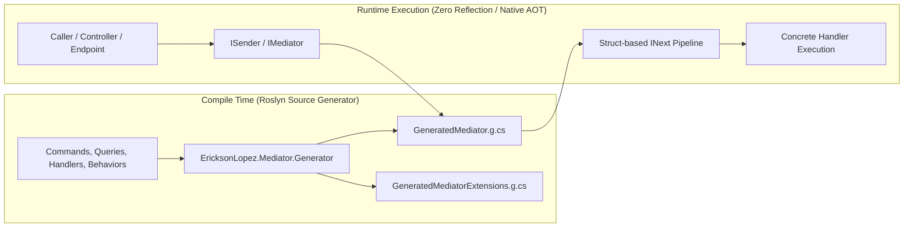
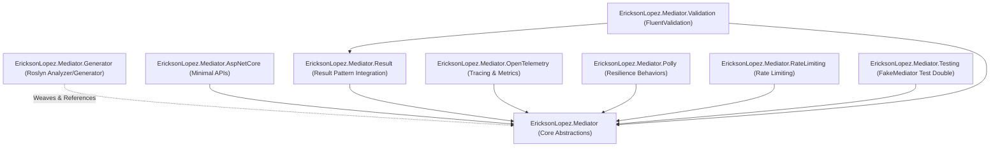
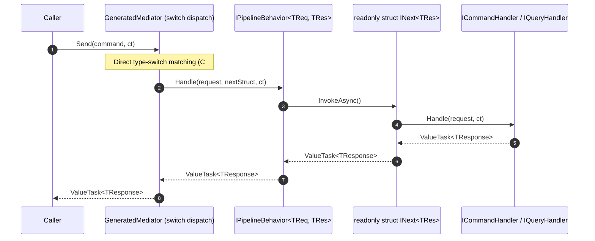
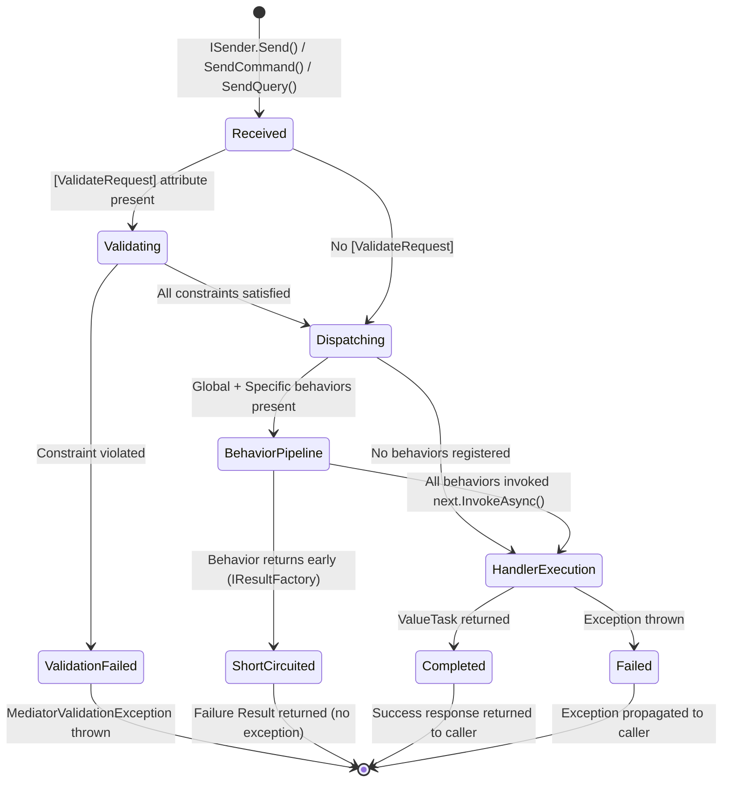
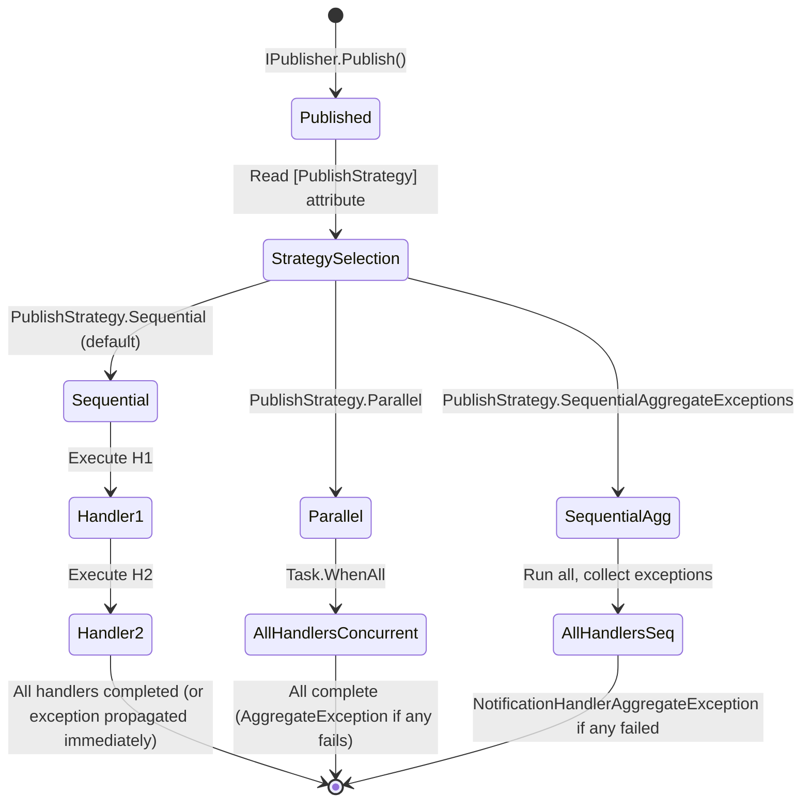
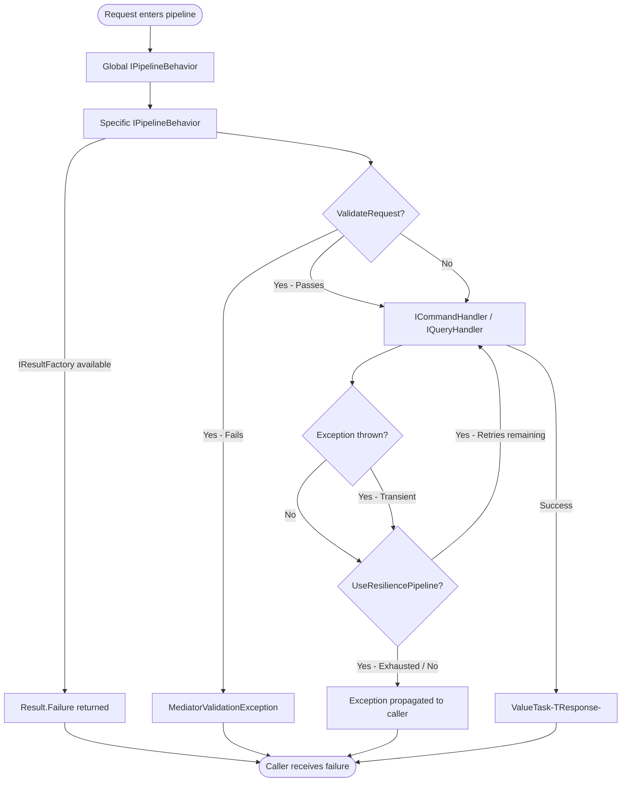
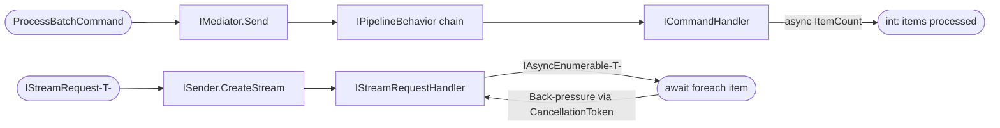

# Architecture Overview — EricksonLopez.Mediator

`EricksonLopez.Mediator` is a high-performance, zero-allocation, compile-time mediated CQRS pipeline implementation for .NET 8, 9, and 10.

---

## 1. High-Level Architectural Vision

Unlike traditional mediator implementations in .NET that rely on runtime reflection, runtime DI container resolution per handler, delegate closures, and boxing, `EricksonLopez.Mediator` moves all routing, pipeline weaving, and dependency resolution to **compile time** using **Roslyn Incremental Source Generators**.



---



| Package | Purpose | Runtime Dependencies | AOT Ready |
|---|---|---|---|
| `EricksonLopez.Mediator` | Core abstractions (`ICommand`, `IQuery`, `INotification`, `IStreamRequest`, `IMediator`, `ISender`, `IPublisher`, `INext`, `StaticMediator`) | `Microsoft.Extensions.DependencyInjection.Abstractions`, `Microsoft.Extensions.Diagnostics.HealthChecks.Abstractions` | ✅ 100% |
| `EricksonLopez.Mediator.Generator` | Incremental Roslyn Source Generator weaving the dispatcher, DI extensions, and diagnostics (`ELM001`–`ELM011`) | Roslyn Analyzer only (development dependency) | N/A |
| `EricksonLopez.Mediator.AspNetCore` | Minimal API endpoint mapping extensions (`MapCommand`, `MapQuery`) | `EricksonLopez.Mediator`, `Microsoft.AspNetCore.App` | ⚠️ Requires AOT config (`[RequiresUnreferencedCode]` on public methods) |
| `EricksonLopez.Mediator.OpenTelemetry` | Distributed tracing (`ActivitySource`) and performance metrics (`Meter`) | `EricksonLopez.Mediator`, `OpenTelemetry.Api` | ✅ 100% (type name caching via closed generic static fields — ADR-030) |
| `EricksonLopez.Mediator.Polly` | Polly v8 resilience policies (retry, circuit breaker, timeout) pipeline behavior | `EricksonLopez.Mediator`, `Polly.Core` | ⚠️ Generally compatible; attribute metadata must be preserved under aggressive trimming |
| `EricksonLopez.Mediator.RateLimiting` | High-throughput rate limiting pipeline behavior | `EricksonLopez.Mediator`, `System.Threading.RateLimiting` | ✅ 100% |
| `EricksonLopez.Mediator.Result` | Type-safe failure result factory (`IResultFactory<TResponse>`) for pipeline short-circuiting | `EricksonLopez.Mediator`, `EricksonLopez.Result` | ✅ 100% |
| `EricksonLopez.Mediator.Testing` | In-memory `FakeMediator` and `DelegateNext` test doubles for unit testing | `EricksonLopez.Mediator` | Test-only |
| `EricksonLopez.Mediator.FluentValidation` | **Recommended** FluentValidation pipeline integration (`ValidationPipelineBehavior<T,R>`, `AddMediatorFluentValidation()`) | `EricksonLopez.Mediator`, `EricksonLopez.Mediator.Result`, `EricksonLopez.Result.FluentValidation` | ⚠️ Behavior itself is AOT-safe; assembly scanning extension uses `[RequiresUnreferencedCode]` |
| `EricksonLopez.Mediator.Validation` | ⚠️ **DEPRECATED (ADR-033)** — archived in v2.0. Use `EricksonLopez.Mediator.FluentValidation` instead. | `EricksonLopez.Mediator`, `EricksonLopez.Mediator.Result`, `EricksonLopez.Result.FluentValidation` | ❌ Not AOT compatible (`[RequiresUnreferencedCode]` on assembly scanning) |

---

## 3. Core Dispatch Architecture

### 3.1 Request / Response Pipeline (Commands & Queries)

When a command (`ICommand<TResponse>`) or query (`IQuery<TResponse>`) is sent via `IMediator.Send`, the dispatch workflow is completely static:



#### Key Performance Mechanics:
1. **Direct Switch Matching**: Dispatches requests via a direct C# type-switch pattern match, avoiding all reflection (`MethodInfo.Invoke` / `MakeGenericMethod`).
2. **Struct Continuations (`INext<TResponse>`)**: The pipeline chain is composed of unboxed `internal readonly struct` instances. Calling `next.InvokeAsync()` is direct and inlinable by RyuJIT and Native AOT compilers, resulting in **0 heap allocations** on synchronous execution paths.
3. **`ValueTask<TResponse>`**: Handlers that return cached or synchronous values avoid `Task` object allocations completely.

---

## 4. Notification & Domain Event Dispatching

Notifications (`INotification`) support multiple subscribers and custom dispatching strategies configured via `[PublishStrategy]`:

```mermaid
graph TD
    Pub["publisher.Publish(notification, ct)"] --> Strategy{PublishStrategy}
    Strategy -->|Sequential (Default)| Seq["Sequential Handler Invocations"]
    Strategy -->|Parallel| Par["Task.WhenAll Concurrency"]
    Strategy -->|SequentialAggregateExceptions| Agg["try / catch per handler -> AggregateException"]
```

### Strategies:
1. **`Sequential` (Default)**: Executes each `INotificationHandler<T>` in sequential order using unboxed `INext` struct continuations.
2. **`Parallel`**: Executes handlers concurrently using `Task.WhenAll`.
3. **`SequentialAggregateExceptions`**: Executes all handlers even if preceding handlers fail, aggregating all thrown exceptions into a `NotificationHandlerAggregateException`.

---

## 5. Architectural Boundaries (What This Library Is NOT)

To maintain extreme performance, simplicity, and architectural purity:

- ❌ **NOT an Outbox / Inbox framework**: Persistent message storage and dual-write guarantees belong in dedicated transactional outbox libraries (e.g. `EricksonLopez.Outbox`).
- ❌ **NOT a Distributed Message Broker**: Network transports (RabbitMQ, Kafka, Azure Service Bus) belong in external messaging frameworks.
- ❌ **NO Runtime Reflection in Core Hot Path**: The `EricksonLopez.Mediator` Core package uses no `Activator.CreateInstance`, `Assembly.GetTypes()`, or `MakeGenericType` at runtime. Note: integration packages (AspNetCore, Polly) use controlled reflection in initialization paths — see [Package Catalog](packages.md) for per-package AOT status.
- ❌ **NO Implicit Magic**: All handlers must explicitly implement `ICommandHandler`, `IQueryHandler`, or `INotificationHandler`.

---

## 6. State Diagram: Request Lifecycle



---

## 7. State Diagram: Notification Lifecycle



---

## 8. Error Handling Flow



---

## 9. Processing Flow: Batch and Streaming



