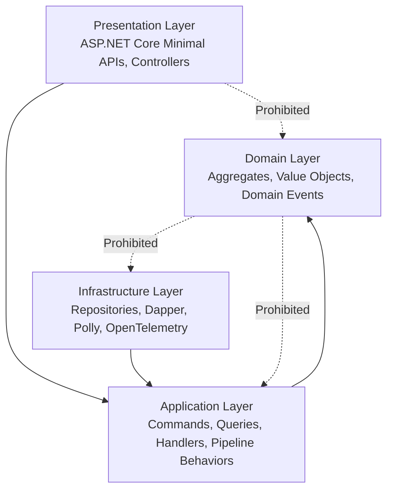

# Ecosystem Boundaries & Layer Invariants

## 1. Clean Architecture Layer Boundaries

---

## 2. Permitted vs Prohibited Mediator Interactions

| Layer | Permitted Mediator Usages | Prohibited Usages |
|---|---|---|
| **Domain** | Defines `INotification` domain events. | Zero references to `ISender`, `IMediator`, or pipeline behaviors. |
| **Application** | Defines `ICommand`, `IQuery`, `ICommandHandler`, `IQueryHandler`, `IPipelineBehavior`. | Zero references to ASP.NET Core or direct DB connections. |
| **Infrastructure** | Implements external behavior adapters (Polly, OpenTelemetry, Redis caching). | Modifying CQRS command/query contracts. |
| **Presentation** | Dispatches requests via `ISender.Send(command)`. | Direct business validation or DB persistence queries. |
