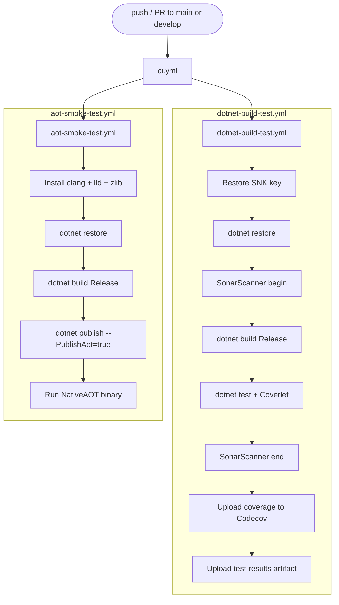

# CI/CD Pipeline

The `EricksonLopez.Mediator` ecosystem uses a GitHub Actions pipeline with 8 specialized
workflows. The architecture separates **continuous integration** from **mutation testing**,
**benchmarking**, and **publishing** — each runs independently on its own schedule or trigger.

---

## 1. Workflow Overview

| Workflow | File | Trigger | Purpose |
|---|---|---|---|
| **CI** | `ci.yml` | `push`/`PR` → `main`, `develop` | Orchestrator: calls build-test + AOT smoke test |
| **Reusable Build & Test** | `dotnet-build-test.yml` | `workflow_call` | Build, test, coverage, SonarCloud |
| **NativeAOT Smoke Test** | `aot-smoke-test.yml` | `push`/`PR`, `workflow_call`, `workflow_dispatch` | Compile and run a NativeAOT binary |
| **Publish NuGet** | `publish.yml` | `push v*.*.*` tag, `workflow_dispatch` | Pack + sign + publish all packages |
| **Release Please** | `release-please.yml` | `push` → `main` | Automated release PR + dispatch publish |
| **Mutation Testing** | `mutation-testing.yml` | Schedule Mon 04:00 UTC, `workflow_dispatch` | Stryker mutation analysis (not in main CI) |
| **Benchmarks** | `benchmarks.yml` | `workflow_call`, `workflow_dispatch` | BenchmarkDotNet baseline capture (quality gate in `publish.yml`) |
| **Weekly Benchmarks** | `weekly-benchmarks.yml` | Schedule Sun 02:00 UTC, `workflow_dispatch` | Deep benchmark: .NET 8 + 9 + 10 |

---

## 2. CI Pipeline Flow

The main CI orchestrator (`ci.yml`) runs on every push and pull request to `main`
or `develop`. It is deliberately minimal — it delegates all heavy lifting to
reusable workflows via `uses:`.



> [!NOTE]
> **Mutation Testing is NOT part of the main CI.** It runs as a separate scheduled
> job (`mutation-testing.yml`) every Monday at 04:00 UTC, or on manual dispatch.
> This is intentional — Stryker runs can take up to 60 minutes.

---

## 3. Release → Publish Flow

Releases are managed by **Release Please** (`release-please.yml`), which creates
automated release PRs based on Conventional Commits. When a release PR is merged:

1. Release Please creates a GitHub Release and a `vX.Y.Z` git tag.
2. `release-please.yml` dispatches `publish.yml` via `workflow_dispatch`, passing
   the resolved version number.

```mermaid
flowchart LR
    A([Conventional Commit merged to main]) --> B[release-please.yml]
    B --> C{Release PR exists?}
    C -- No --> D[Create/Update Release PR]
    C -- Yes, merged --> E[Create GitHub Release + tag vX.Y.Z]
    E --> F[Dispatch publish.yml]

    subgraph publish.yml
        F --> G[Restore SNK key]
        G --> H[dotnet restore + build Release]
        H --> I[dotnet test — publish gate]
        I --> J[Upload coverage — publish-gate flag]
        J --> K[dotnet pack — all packages]
        K --> L[Sigstore Provenance Attestation]
        L --> M[NuGet OIDC login]
        M --> N[dotnet nuget push --skip-duplicate]
        N --> O[Create GitHub Release body with package table]
    end
```



---

## 4. Reusable Workflow — `dotnet-build-test.yml`

All callers of this workflow must pass secrets explicitly.

### Inputs

| Input | Type | Default | Description |
|---|---|---|---|
| `dotnet-version` | `string` | `10.0.x` | .NET SDK version |
| `test-filter` | `string` | `""` | `dotnet test --filter` expression |
| `test-project` | `string` | `""` | Specific test project path |
| `upload-coverage` | `boolean` | `true` | Upload coverage to Codecov |
| `artifact-name` | `string` | `test-results` | Artifact upload name |

### Secrets

| Secret | Required | Description |
|---|---|---|
| `SNK_KEY` | Optional | Base64-encoded `.snk` for strong-name signing |
| `CODECOV_TOKEN` | Optional | Codecov upload token |
| `SONAR_TOKEN` | Optional | SonarCloud analysis token |


### Artifacts Produced

| Artifact | Path | Retention |
|---|---|---|
| `test-results` (configurable) | `./test-results/` | Default GitHub Actions |
| `coverage.opencover.xml` | `./test-results/**/` | Uploaded to Codecov |
| `coverage.cobertura.xml` | `./test-results/**/` | Uploaded to Codecov |

---

## 5. NativeAOT Smoke Test — `aot-smoke-test.yml`

Tests that all packages with `IsAotCompatible=true` actually compile and run
under NativeAOT (ILC). Runs on every push/PR alongside the main CI, and can
also be called as a reusable workflow.

**Secrets Required:**
| Secret | Required | Description |
|---|---|---|
| `SNK_KEY` | Optional | Base64-encoded `.snk` for strong-name signing |

**Key flags used during publish:**
```
-p:PublishAot=true
-p:TreatWarningsAsErrors=true
-p:WarningLevel=5
DOTNET_EnableAotCompilationWarningsAsErrors=true
```

This configuration causes the build to fail on any `IL2026` (Reflection) or
`IL3050` (dynamic code) warnings, making NativeAOT compliance a hard gate.

> [!IMPORTANT]
> The AOT smoke test uses .NET **8.0.x** SDK (not 10.0.x) for the `dotnet publish`
> step. This ensures compatibility with the lowest supported TFM of the core package.

---

## 6. Mutation Testing — `mutation-testing.yml`

Stryker.NET runs as a dedicated weekly scheduled workflow (Monday 04:00 UTC) and on manual dispatch. It executes a **9-job parallel matrix** covering all source packages:

| Parameter | Value |
|---|---|
| **Schedule** | Every Monday at 04:00 UTC |
| **Matrix Strategy** | 9 parallel jobs: `Core`, `Generator`, `OpenTelemetry`, `Polly`, `Result`, `Testing`, `Validation`, `AspNetCore`, `RateLimiting` |
| **Mutation Level** | `Standard` (default); `Basic` or `Advanced` via `workflow_dispatch` |
| **Report Formats** | HTML, JSON, cleartext, progress (30-day artifact retention) |
| **Threshold Policy** | Runtime libraries: High: 100%, Low: 98%, Break: 95% <br/> Roslyn Generator / Consolidated Gate: High: 100%, Low: 95%, Break: 90% |
| **Consolidated Gate** | `mutation-gate-summary` job aggregates all JSON reports, calculates ecosystem-wide mutation score (Break: ≥90%), and publishes GitHub Commit Status (`mutation-testing/stryker`) |

### Stryker Config Files:
- `stryker-config.json` — Core library (`EricksonLopez.Mediator`)
- `stryker-generator-config.json` — Source Generator (`EricksonLopez.Mediator.Generator`)
- `stryker-aspnetcore-config.json` — Minimal APIs (`EricksonLopez.Mediator.AspNetCore`)
- `stryker-opentelemetry-config.json` — OpenTelemetry (`EricksonLopez.Mediator.OpenTelemetry`)
- `stryker-polly-config.json` — Resilience (`EricksonLopez.Mediator.Polly`)
- `stryker-ratelimiting-config.json` — Rate Limiting (`EricksonLopez.Mediator.RateLimiting`)
- `stryker-result-config.json` — Result integration (`EricksonLopez.Mediator.Result`)
- `stryker-testing-config.json` — Testing utilities (`EricksonLopez.Mediator.Testing`)
- `stryker-validation-config.json` — Validation (`EricksonLopez.Mediator.Validation`)
- `stryker-config-unit.json` — Fast local developer smoke test config

Stryker exclusions (configured in both config files):
- Generated files (`*.g.cs`, `Generated/**`)
- Source generators (`*Generator.cs`, `SourceGenerators/**`)
- Analyzers (`EricksonLopez.Mediator.Analyzers/**`, `*Analyzer.cs`, `*CodeFixProviders.cs`)
- Testing helpers (`Testing/**`)

---

## 7. Benchmarks — `benchmarks.yml` and `weekly-benchmarks.yml`

Two benchmark workflows exist:

| Workflow | Trigger | Runtimes | Timeout | Commit results? |
|---|---|---|---|---|
| `benchmarks.yml` | `workflow_call` (via `publish.yml`), `workflow_dispatch` | net8.0, net9.0, net10.0 | 60 min | Configurable (default `false` in release gate, `true` in manual dispatch) |
| `weekly-benchmarks.yml` | Sun 02:00 UTC, `workflow_dispatch` | net8.0, net9.0, net10.0 | 300 min | Yes (auto-commit) |

Benchmark results are exported as JSON and Markdown and committed to
`benchmarks/results/` in the repository (with `[skip ci]` to prevent re-triggering).
Artifacts are retained for 90 days.

---

## 8. Supply Chain Security

| Mechanism | Implementation |
|---|---|
| **Strong Name Signing** | `EricksonLopez.snk` — base64 stored in `SNK_KEY` secret; decoded at build time |
| **OIDC Trusted Publishing** | `NuGet/login@v1` — no static API key; GitHub OIDC authenticates to NuGet.org |
| **Sigstore Provenance Attestation** | `actions/attest-build-provenance@v2` applied to all `.nupkg` files |
| **NuGet Audit** | `NuGetAudit=true`, `NuGetAuditMode=all`, `NuGetAuditLevel=low` in `Directory.Build.props` |
| **Dependabot** | NuGet (weekly Mon), GitHub Actions (monthly Mon) |

---

## 9. Branch Strategy

Based on CI trigger analysis:

| Branch | Protected | CI Runs |
|---|---|---|
| `main` | Yes | On `push` and `PR` |
| `develop` | Partially | On `push` and `PR` |

> [!NOTE]
> No evidence of `hotfix/*` or `release/*` branches in any workflow trigger.
> The project uses **trunk-based development** with Release Please managing releases
> from `main`.

---

## 10. Pre-Release Detection

The `publish.yml` workflow detects pre-release versions:

```yaml
prerelease: ${{ contains(steps.version.outputs.VERSION, '-') }}
```

A tag like `v1.0.0-preview.1` sets `prerelease: true` on the GitHub Release and
the NuGet package will be published as a pre-release.
