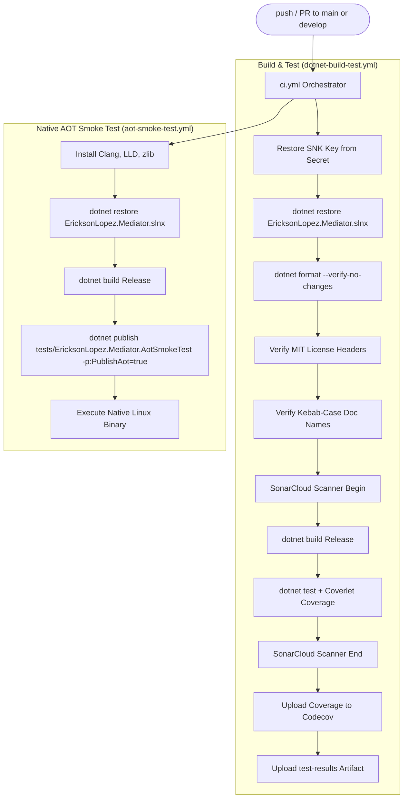

# CI/CD Pipelines & Quality Infrastructure

The `EricksonLopez.Mediator` ecosystem uses a comprehensive GitHub Actions CI/CD pipeline comprising 10 specialized workflows. The architecture strictly segregates **continuous integration** from **mutation testing**, **performance regression gating**, **governance compliance**, and **release publishing**.

---

## 1. Workflow Catalog

| Workflow | File | Trigger | Purpose |
|---|---|---|---|
| **CI Orchestrator** | `.github/workflows/ci.yml` | `push`, `pull_request` → `main`, `develop` | Orchestrates parallel build, unit tests, coverage, and Native AOT smoke testing |
| **Reusable Build & Test** | `.github/workflows/dotnet-build-test.yml` | `workflow_call` | Restores SNK, builds, runs tests with Coverlet, and reports to SonarCloud & Codecov |
| **Native AOT Smoke Test** | `.github/workflows/aot-smoke-test.yml` | `push`, `pull_request`, `workflow_call`, `workflow_dispatch` | Cross-compiles (`PublishAot=true`) and executes native Linux binary with zero trimming warnings |
| **Repository Compliance** | `.github/workflows/repo-compliance.yml` | `push`, `pull_request` → `main`, `workflow_dispatch` | Zero-tolerance governance auditor enforcing kebab-case docs, license headers, and CPM invariants |
| **Benchmark Regression Gate** | `.github/workflows/benchmark-regression-gate.yml` | `pull_request` → `main`, `develop` (paths: `src/**`, `benchmarks/**`) | Runs PR micro-benchmarks and asserts 0 B allocation invariant and ≤ 5% latency regression |
| **Release Please** | `.github/workflows/release-please.yml` | `push` → `main` | Analyzes Conventional Commits, maintains `CHANGELOG.md`, tags releases, and triggers `publish.yml` |
| **Publish NuGet** | `.github/workflows/publish.yml` | `push` tag `v*.*.*`, `workflow_dispatch` | Evaluates mutation & benchmark gates, packs, RSA signs, attests build provenance, and pushes to NuGet.org |
| **Mutation Testing** | `.github/workflows/mutation-testing.yml` | Schedule (Mon 04:00 UTC), `workflow_call`, `workflow_dispatch` | Stryker.NET 10-job matrix execution across all packages (High=100%, Low=98%, Break=95%) |
| **Benchmark Baseline Capture** | `.github/workflows/benchmarks.yml` | `workflow_call` (via `publish.yml`), `workflow_dispatch` | Executes BenchmarkDotNet and commits baseline results to `benchmarks/results/` |
| **Weekly Deep Benchmarks** | `.github/workflows/weekly-benchmarks.yml` | Schedule (Sun 02:00 UTC), `workflow_dispatch` | Multi-TFM deep statistical benchmark review across .NET 8, 9, and 10 |

---

## 2. CI Pipeline Architecture

The primary continuous integration orchestrator (`ci.yml`) runs on every commit and pull request to `main` and `develop`. It delegates execution to reusable sub-workflows running in parallel:



---

## 3. Release & NuGet Publication Pipeline

Package publishing is triggered either automatically when a Release PR is merged via Release Please, or manually by pushing a `v*.*.*` tag. The publishing workflow enforces rigorous quality gates before artifacts reach NuGet.org:

```mermaid
flowchart TD
    Start([Release PR Merged / v*.*.* Tag]) --> RP[release-please.yml]
    RP --> Dispatch[Dispatch publish.yml with SemVer]

    subgraph PrePublishQualityGates["Pre-Publish Quality Gates"]
        Dispatch --> Gate1[Job: mutation-tests -> mutation-testing.yml]
        Dispatch --> Gate2[Job: benchmark-gate -> benchmarks.yml]
        Gate1 & Gate2 --> PublishJob[Job: publish]
        PublishJob --> ScriptGate[Validate Stryker Gate via verify-mutation-gate.js]
    end

    subgraph PackAndPublish["Artifact Generation & Distribution"]
        ScriptGate --> RestoreKey[Restore EricksonLopez.snk]
        RestoreKey --> FullBuild[dotnet build Release]
        FullBuild --> FullTest[dotnet test + Publish Gate Coverage]
        FullTest --> PackAll[dotnet pack 10 Packages to ./nupkgs/]
        PackAll --> Sigstore[actions/attest-build-provenance@v2]
        Sigstore --> OIDCLogin[NuGet/login@v1 OIDC Authentication]
        OIDCLogin --> PushNuGet[dotnet nuget push to api.nuget.org --skip-duplicate]
        PushNuGet --> GhRelease[Create GitHub Release with Ecosystem Matrix]
    end
```

---

## 4. Quality Gates & Governance Audit Scripts

The repository includes dedicated verification scripts executed locally and in CI:

### 4.1 Repository Compliance (`scripts/verify-compliance.ps1`)
Executed on every push to `main` via `repo-compliance.yml`:
1. **Kebab-Case Naming**: Enforces `^[a-z0-9]+(-[a-z0-9]+)*\.md$` across all `/docs/` files.
2. **Zero `[Obsolete]`**: Verifies zero deprecated API usages in production code (`src/`).
3. **MIT License Headers**: Checks canonical copyright header on all `.cs` source files.
4. **Single Type per File**: Enforces architectural isolation in `src/`.
5. **GitHub Identity Normalization**: Validates references target `ericksonlopezf/dotnet-mediator`.
6. **Support Email Normalization**: Validates `ericksonlopezf@gmail.com`.
7. **NoWarn Governance**: Prevents prohibited warning suppressions (e.g. CS0618/CS0619).
8. **Stryker Parity Gate**: Verifies exact 1:1 parity between `src/` projects and Stryker profiles.
9. **README Package Table Parity**: Ensures all 10 projects in `src/` are documented in `README.md`.
10. **Test Suite Symmetry**: Enforces dedicated test suites or direct project references for all packages.

### 4.2 Benchmark Regression Gate (`scripts/verify-benchmark-gate.ps1`)
Executed on every pull request altering `src/**` or `benchmarks/**`:
- **Zero-Allocation Invariant**: Asserts exactly 0 B heap allocated on the hot path.
- **Latency Threshold**: Asserts PR mean execution latency does not regress > 5% vs `benchmarks/results/baseline.json`.

---

## 5. Mutation Testing Infrastructure (`mutation-testing.yml`)

Stryker.NET executes across a 10-job parallel matrix covering all packages:

| Matrix Job | Target Project | Configuration File |
|---|---|---|
| **Core** | `src/EricksonLopez.Mediator` | `stryker-config.json` |
| **Generator** | `src/EricksonLopez.Mediator.Generator` | `stryker-generator-config.json` |
| **AspNetCore** | `src/EricksonLopez.Mediator.AspNetCore` | `stryker-aspnetcore-config.json` |
| **Caching** | `src/EricksonLopez.Mediator.Caching` | `stryker-caching-config.json` |
| **FluentValidation** | `src/EricksonLopez.Mediator.FluentValidation` | `stryker-fluentvalidation-config.json` |
| **OpenTelemetry** | `src/EricksonLopez.Mediator.OpenTelemetry` | `stryker-opentelemetry-config.json` |
| **Polly** | `src/EricksonLopez.Mediator.Polly` | `stryker-polly-config.json` |
| **RateLimiting** | `src/EricksonLopez.Mediator.RateLimiting` | `stryker-ratelimiting-config.json` |
| **Result** | `src/EricksonLopez.Mediator.Result` | `stryker-result-config.json` |
| **Testing** | `src/EricksonLopez.Mediator.Testing` | `stryker-testing-config.json` |

### Threshold Policy:
- **High ($\ge 100\%$)**: Target threshold.
- **Low ($\ge 98\%$)**: Acceptable threshold.
- **Warning ($\ge 95\%$)**: Approaching break limit.
- **Break ($< 95\%$)**: Hard gate failure; pipeline aborts and blocks publish.

---

## 6. Supply Chain Security Invariants

1. **Strong Name Assembly Signing**:
   - `Directory.Build.props` automatically signs all assemblies if `EricksonLopez.snk` is present.
   - CI workflows decode the RSA private key from the encrypted secret `SNK_KEY`.
2. **NuGet Trusted Publishing (OIDC)**:
   - Publication uses short-lived GitHub Actions OpenID Connect tokens (`id-token: write`).
   - No permanent static NuGet API keys are stored in the repository.
3. **Cryptographic Build Provenance (Sigstore)**:
   - `actions/attest-build-provenance@v2` signs and registers all `.nupkg` artifacts with Sigstore, enabling public verification of package authenticity.
4. **NuGet Vulnerability Auditing**:
   - `<NuGetAudit>true</NuGetAudit>`, `<NuGetAuditMode>all</NuGetAuditMode>`, and `<NuGetAuditLevel>low</NuGetAuditLevel>` in `Directory.Build.props` cause restore and build to fail on known CVEs.
5. **Automated Dependency Updates**:
   - Dependabot actively scans NuGet packages (weekly) and GitHub Actions (monthly).
