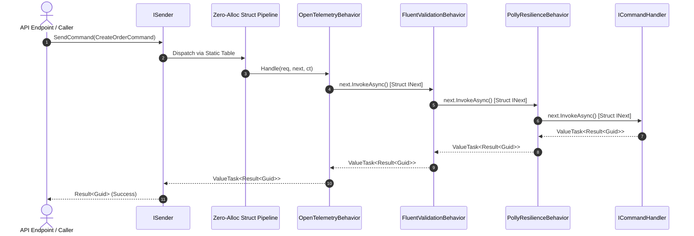
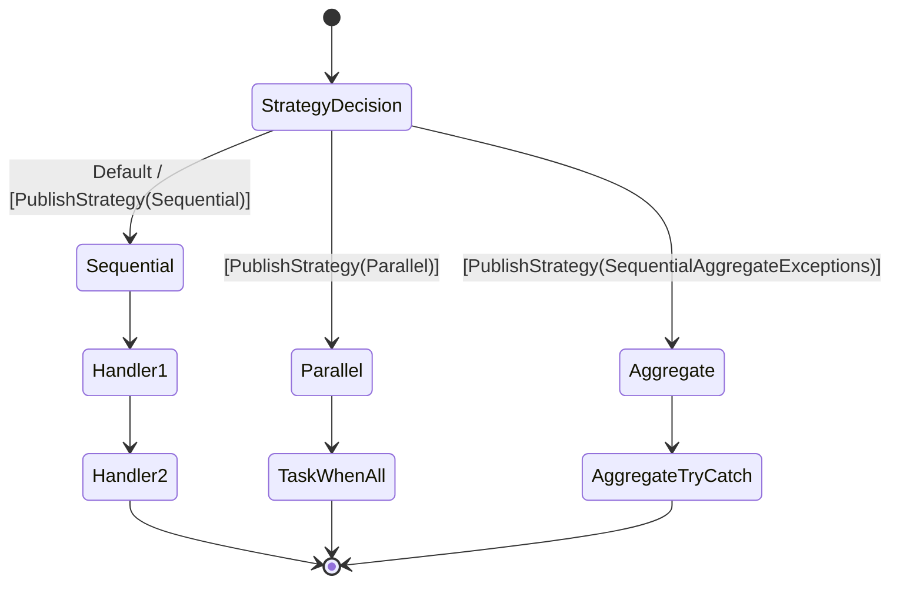

# Architectural Diagrams & Visual Specifications

## 1. Request Pipeline Execution Model

```mermaid
sequenceDiagram
    autonumber
    actor Client as API Endpoint / Caller
    participant Sender as ISender
    participant Pipeline as Zero-Alloc Struct Pipeline
    participant Behavior1 as OpenTelemetryBehavior
    participant Behavior2 as FluentValidationBehavior
    participant Behavior3 as PollyResilienceBehavior
    participant Handler as ICommandHandler

    Client->>Sender: SendCommand(CreateOrderCommand)
    Sender->>Pipeline: Dispatch via Static Table
    Pipeline->>Behavior1: Handle(req, next, ct)
    Behavior1->>Behavior2: next.InvokeAsync() [Struct INext]
    Behavior2->>Behavior3: next.InvokeAsync() [Struct INext]
    Behavior3->>Handler: next.InvokeAsync() [Struct INext]
    Handler-->>Behavior3: ValueTask<Result<Guid>>
    Behavior3-->>Behavior2: ValueTask<Result<Guid>>
    Behavior2-->>Behavior1: ValueTask<Result<Guid>>
    Behavior1-->>Sender: ValueTask<Result<Guid>>
    Sender-->>Client: Result<Guid> (Success)
```

---

## 2. Notification Dispatch Strategies

```mermaid
stateDiagram-v2
    [*] --> StrategyDecision
    StrategyDecision --> Sequential: Default / [PublishStrategy(Sequential)]
    StrategyDecision --> Parallel: [PublishStrategy(Parallel)]
    StrategyDecision --> Aggregate: [PublishStrategy(SequentialAggregateExceptions)]

    Sequential --> Handler1
    Handler1 --> Handler2
    Handler2 --> [*]

    Parallel --> TaskWhenAll
    TaskWhenAll --> [*]

    Aggregate --> AggregateTryCatch
    AggregateTryCatch --> [*]
```
