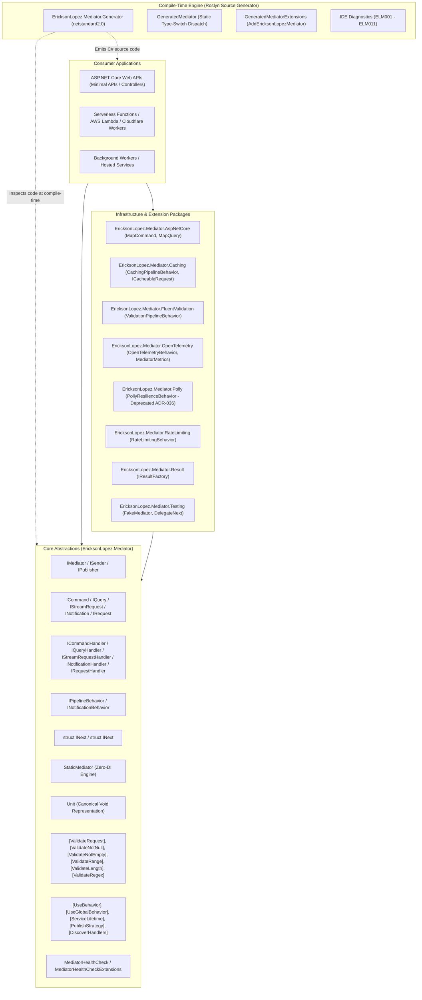
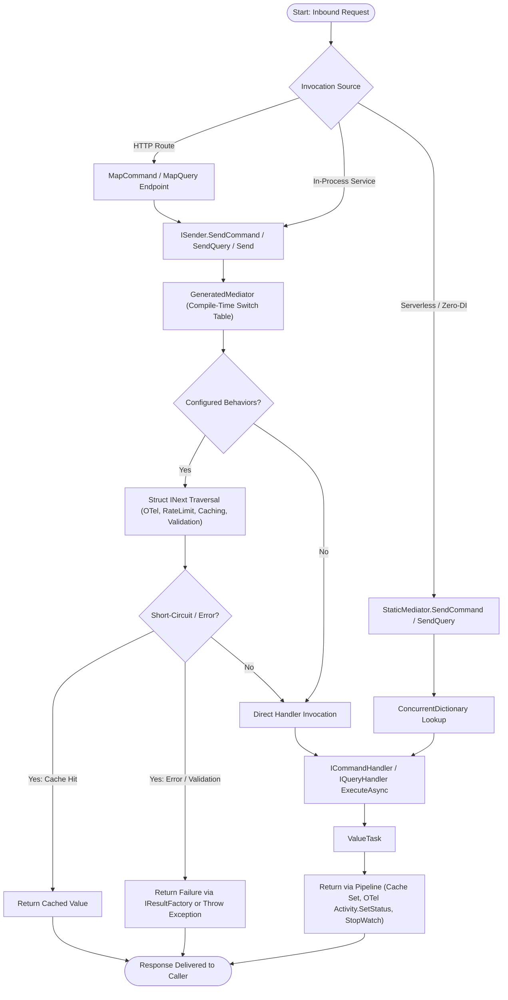
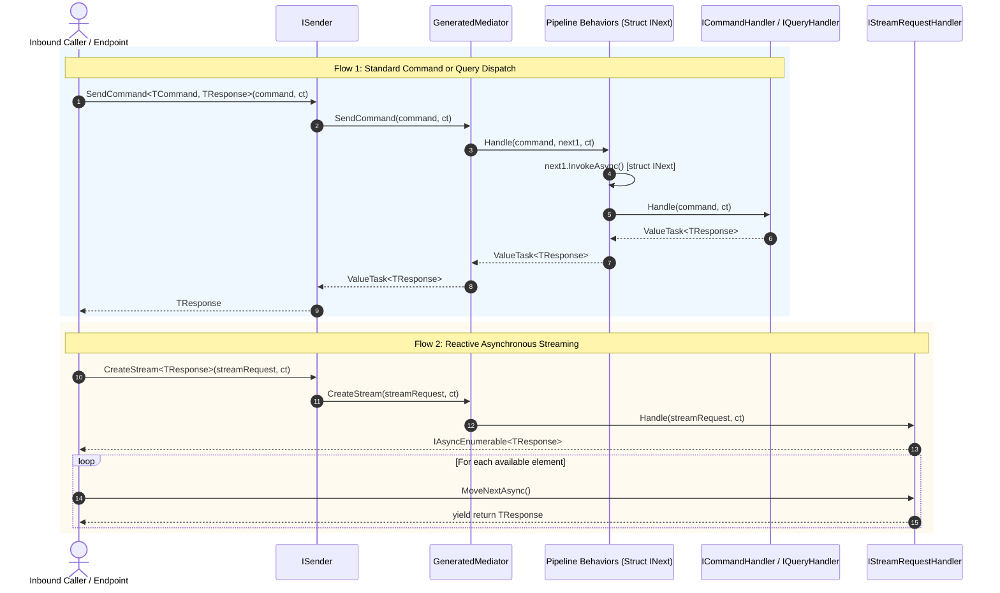
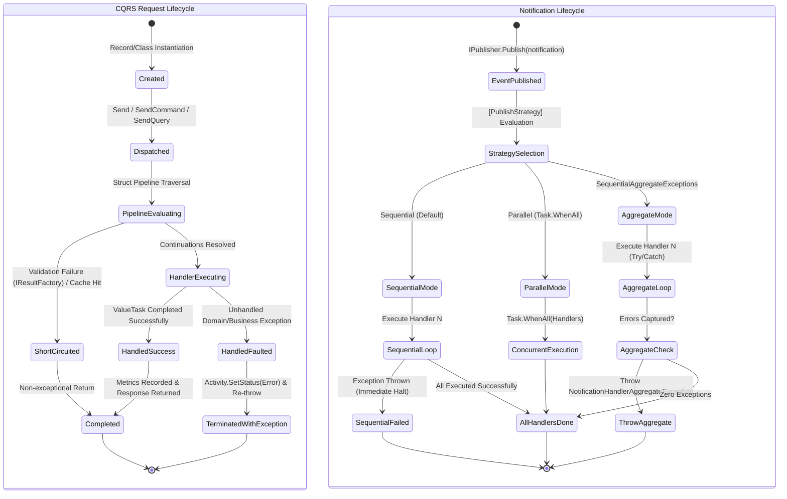
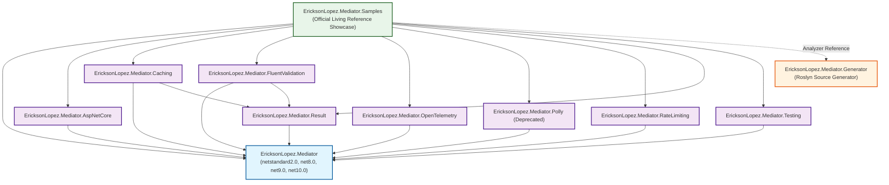
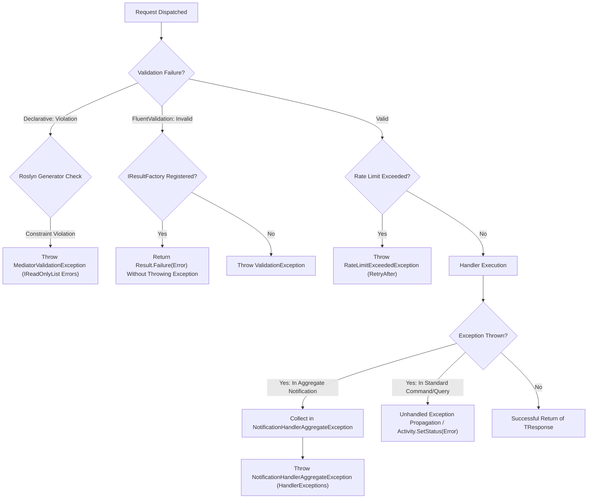

# Comprehensive Architectural Diagrams — EricksonLopez.Mediator

This document contains the official Mermaid diagrams documenting the verified architecture and runtime topology of `EricksonLopez.Mediator`.

---

## 1. Overall System Architecture

---

## 2. Main System Execution Flow

---

## 3. Sequence Diagram (Synchronous Dispatch & Reactive Streaming)

---

## 4. State Machine Diagram (Request & Notification Lifecycles)

---

## 5. Component Dependency Graph

---

## 6. Pipeline Architecture & Zero-Allocation Struct Continuations

```mermaid
classDiagram
    class IPipelineBehavior~TRequest, TResponse~ {
        <<interface>>
        +Handle~TNext~(request: TRequest, next: TNext, cancellationToken: CancellationToken) ValueTask~TResponse~
    }

    class INext~TResponse~ {
        <<interface>>
        +InvokeAsync() ValueTask~TResponse~
    }

    class INotificationBehavior~TNotification~ {
        <<interface>>
        +Handle~TNext~(notification: TNotification, next: TNext, cancellationToken: CancellationToken) ValueTask
    }

    class INext {
        <<interface>>
        +InvokeAsync() ValueTask
    }

    class StructNextWrapper1 {
        <<struct>>
        -behavior2: IPipelineBehavior
        -innerNext: StructNextWrapper2
        +InvokeAsync() ValueTask~TResponse~
    }

    class StructNextWrapper2 {
        <<struct>>
        -handler: ICommandHandler
        +InvokeAsync() ValueTask~TResponse~
    }

    class DelegateNext~TResponse~ {
        <<struct>>
        -continuation: Func~ValueTask~TResponse~~
        +InvokeAsync() ValueTask~TResponse~
    }

    class DelegateNext {
        <<struct>>
        -continuation: Func~ValueTask~
        +InvokeAsync() ValueTask
    }

    IPipelineBehavior ..> INext : Uses in Handle
    INotificationBehavior ..> INext : Uses in Handle
    StructNextWrapper1 ..|> INext : Implements
    StructNextWrapper2 ..|> INext : Implements
    DelegateNext ..|> INext : Implements (Testing)
    DelegateNext ..|> INext : Implements (Testing)
```

---

## 7. Processing Models (Concurrency, Batching & Streaming)

```mermaid
flowchart TD
    subgraph StreamPattern["1. Asynchronous Streaming (IStreamRequest<T>)"]
        SReq[IStreamRequest<T>] --> SHandler[IStreamRequestHandler]
        SHandler --> GeneratorYield["yield return item (IAsyncEnumerable<T>)"]
        GeneratorYield --> ConsumerEnumerator["await foreach (var item in stream)"]
        ConsumerEnumerator --> ProcessChunk[Immediate Chunk Processing]
    end

    subgraph ParallelPub["2. Concurrent Publishing ([PublishStrategy(Parallel)])"]
        PNotif[INotification] --> TaskWhenAllSplit["Task.WhenAll"]
        TaskWhenAllSplit --> HandlerA["NotificationHandler A (Search Indexing)"]
        TaskWhenAllSplit --> HandlerB["NotificationHandler B (Cache Invalidation)"]
        TaskWhenAllSplit --> HandlerC["NotificationHandler C (Dashboard Metrics)"]
        HandlerA & HandlerB & HandlerC --> TaskWhenAllJoin[Concurrent Completion of All Tasks]
    end

    subgraph RateLimitedProc["3. Controlled Throughput (RateLimitingBehavior)"]
        Request[Incoming Request] --> AcquireLease["RateLimiter.AcquireAsync(1, ct)"]
        AcquireLease --> LeaseDecision{Lease Acquired?}
        LeaseDecision -->|Yes| PipelineContinue[Execute Pipeline and Handler]
        LeaseDecision -->|No| ThrowRateLimit["Throw RateLimitExceededException(RetryAfter)"]
    end
```

---

## 8. Error Handling and Resilience Architecture

