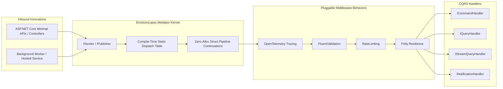

# Functional Domain Map & Dispatch Topology

## 1. Mediator Message Topology

```mermaid
flowchart LR
    subgraph Inbound["Inbound Invocations"]
        API[ASP.NET Core Minimal APIs / Controllers]
        Worker[Background Worker / Hosted Service]
    end

    subgraph MediatorEngine["EricksonLopez.Mediator Kernel"]
        Sender[ISender / IPublisher]
        StaticTable[Compile-Time Static Dispatch Table]
        PipelineChain[Zero-Alloc Struct Pipeline Continuations]
    end

    subgraph Middleware["Pluggable Middleware Behaviors"]
        OTel[OpenTelemetry Tracing]
        Val[FluentValidation]
        Rate[RateLimiting]
        Resil[Polly Resilience]
    end

    subgraph Handlers["CQRS Handlers"]
        CmdH[ICommandHandler<TCommand, TResponse>]
        QryH[IQueryHandler<TQuery, TResponse>]
        StreamH[IStreamQueryHandler<TQuery, TResponse>]
        NotifH[INotificationHandler<TNotification>]
    end

    API & Worker --> Sender
    Sender --> StaticTable
    StaticTable --> PipelineChain
    PipelineChain --> OTel --> Val --> Rate --> Resil
    Resil --> CmdH & QryH & StreamH & NotifH
```
