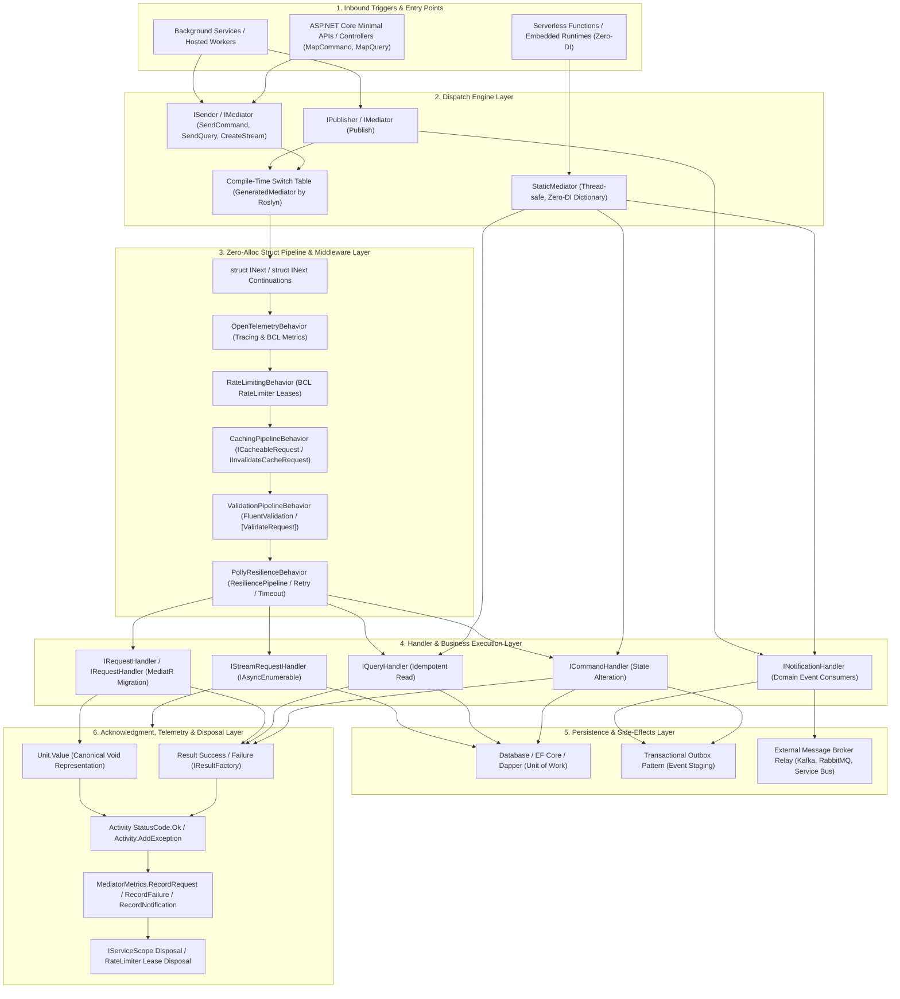

# Functional Domain Map & Architectural Topology — EricksonLopez.Mediator

This document provides a comprehensive functional map and architectural interaction diagram for all components in `EricksonLopez.Mediator`, detailing the end-to-end lifecycle of a message from inbound ingestion through handler execution, side-effect persistence, and final disposal.

---

## 1. System Topology and End-to-End Execution Flow

---

## 2. Detailed Layer Transitions

### Transition 1: Inbound Entry -> Dispatch Layer
1. **Minimal APIs (`EricksonLopez.Mediator.AspNetCore`)**: Endpoints exposed via `endpoints.MapCommand<TCommand, TResponse>(pattern)` or `endpoints.MapQuery<TQuery, TResponse>(pattern)` receive deserialized HTTP requests and delegate execution directly to `ISender.SendCommand` or `ISender.SendQuery`.
2. **Background Workers**: Hosted services (`IHostedService`, `BackgroundService`) inject `ISender` or `IPublisher` to execute scheduled background tasks or broadcast integration events.
3. **Serverless Environments (Zero-DI)**: In environments with strict cold-start latency requirements (AWS Lambda, Azure Functions), `StaticMediator` acts as the direct entry point invoking statically registered handlers without initializing an `IServiceProvider` container.

### Transition 2: Dispatch Layer -> Middleware Pipeline
1. **Compile-Time Static Dispatch**: `GeneratedMediator` (emitted by Roslyn) uses a static compile-time `switch` statement to route requests to handlers without calling `Type.MakeGenericType`, `MethodInfo.Invoke`, or runtime reflection.
2. **Struct Continuations (`INext<TResponse>`)**: Instead of allocating anonymous delegate closures (`Func<Task<T>>`) on the heap for each middleware layer, the pipeline uses typed struct continuations (`INext<TResponse>`), guaranteeing **0 bytes** of managed heap allocation across the entire middleware chain.

### Transition 3: Pipeline -> Business Handlers
1. **OpenTelemetry (`EricksonLopez.Mediator.OpenTelemetry`)**: Starts an `Activity` for distributed tracing and captures the start timestamp.
2. **Rate Limiting (`EricksonLopez.Mediator.RateLimiting`)**: Acquires a lease from the BCL `RateLimiter`. If the limit is exceeded, execution aborts with `RateLimitExceededException` carrying the suggested `RetryAfter` duration.
3. **Transparent Caching (`EricksonLopez.Mediator.Caching`)**: For `ICacheableRequest` instances, queries the cache provider. On a cache hit, returns the cached response immediately without invoking downstream continuations. For `IInvalidateCacheRequest` commands, purges the designated cache prefix upon successful execution.
4. **Validation (`EricksonLopez.Mediator.FluentValidation` / Declarative)**: Runs registered `IValidator<T>` instances concurrently. If validation errors occur and an `IResultFactory<TResponse>` is available, returns a typed failure response without throwing exceptions; otherwise throws `ValidationException`.
5. **Resilience (`EricksonLopez.Mediator.Polly`)**: Wraps execution in the configured `ResiliencePipeline` policy (retry, circuit breaker, timeout).

### Transition 4: Handler -> Persistence & Domain Layer
1. **Commands (`ICommandHandler`)**: Mutate domain aggregates and persist changes to the database (Unit of Work). Commands can stage domain events into a transactional outbox table.
2. **Queries (`IQueryHandler`)**: Execute read-only, non-tracking data access (Dapper, EF Core `AsNoTracking`) and project outward DTOs.
3. **Streams (`IStreamRequestHandler`)**: Emit asynchronous element streams via `yield return` in an `IAsyncEnumerable<TResponse>`, enabling reactive item-by-item consumption.

### Transition 5: Notification Publishing to Consumers
1. **Sequential Strategy (`Sequential`)**: Dispatches each subscriber one after another in FIFO order. If a subscriber throws an exception, publishing halts immediately.
2. **Parallel Strategy (`Parallel`)**: Launches all subscribers concurrently using `Task.WhenAll`, maximizing throughput for decoupled I/O operations.
3. **Aggregate Exception Strategy (`SequentialAggregateExceptions`)**: Executes all subscribers sequentially to completion, aggregating any thrown exceptions into a `NotificationHandlerAggregateException`.

### Transition 6: Acknowledgment, Telemetry & Resource Cleanup
1. **Response Return**: Produces `Result<T>` or `Unit.Value` (for void / MediatR commands).
2. **Activity Completion**: Sets `ActivityStatusCode.Ok` or records exceptions with `Activity.AddException(ex)`.
3. **BCL Metrics**: `MediatorMetrics.RecordRequest` records the invocation count, failure counter, and latency histogram in milliseconds (`mediator.request.duration`).
4. **Resource Disposal**: Releases `RateLimiter` leases, closes dependency injection scopes (`IServiceScope`), and cleans up transient references.
