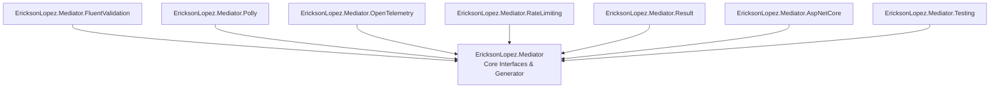

# Package Architecture Reference & Dependency Graph

```mermaid
graph TD
    Abstractions[EricksonLopez.Mediator<br/>Core Interfaces & Generator]
    FluentVal[EricksonLopez.Mediator.FluentValidation]
    PollyPkg[EricksonLopez.Mediator.Polly]
    OTelPkg[EricksonLopez.Mediator.OpenTelemetry]
    RatePkg[EricksonLopez.Mediator.RateLimiting]
    ResultPkg[EricksonLopez.Mediator.Result]
    ApiPkg[EricksonLopez.Mediator.AspNetCore]
    TestingPkg[EricksonLopez.Mediator.Testing]

    FluentVal --> Abstractions
    PollyPkg --> Abstractions
    OTelPkg --> Abstractions
    RatePkg --> Abstractions
    ResultPkg --> Abstractions
    ApiPkg --> Abstractions
    TestingPkg --> Abstractions
```
