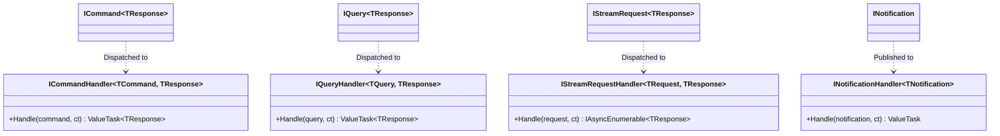

# EricksonLopez.Mediator — Showcase Specification & Architectural Reference

> **Official Reference Implementation and Living Architecture Specification**  
> Target: **.NET 10 / C# 14** · Pattern: **Pure In-Process Mediator & CQRS Engine** · Memory Model: **Zero-Allocation / Native AOT**  
> Status: **100% Synchronized with Public API & Runtime Verified**

---

## 1. Solution Architecture & Package Segregation

The `EricksonLopez.Mediator.slnx` solution organizes mediator infrastructure into fine-grained, decoupled packages:

| Project Path | Category | Architectural Responsibility | Target Framework |
|---|---|---|---|
| `src/EricksonLopez.Mediator` | **Core Package** | Main mediator kernel: `ISender`, `IPublisher`, `IMediator`, `ICommand<T>`, `IQuery<T>`, `INotification`, `IStreamRequest<T>`, struct `INext<T>`, struct `INext`, `Unit`, `StaticMediator`, and `IPipelineBehavior<TRequest, TResponse>`. | `net8.0;net9.0;net10.0` |
| `src/EricksonLopez.Mediator.Generator` | **Compiler Tooling** | Roslyn Incremental Generator analyzing syntax trees and synthesizing static compile-time dispatch tables. | `netstandard2.0` |
| `src/EricksonLopez.Mediator.AspNetCore` | **Presentation** | Minimal API route endpoint extensions (`MapCommand`, `MapQuery`). | `net8.0;net9.0;net10.0` |
| `src/EricksonLopez.Mediator.Caching` | **Middleware** | Transparent response caching (`ICacheableRequest`, `[Cacheable]`, `IInvalidateCacheRequest`, `CachingPipelineBehavior`). | `net8.0;net9.0;net10.0` |
| `src/EricksonLopez.Mediator.FluentValidation` | **Middleware** | Native FluentValidation integration behavior with optional `IResultFactory<TResponse>` pipeline short-circuiting. | `net8.0;net9.0;net10.0` |
| `src/EricksonLopez.Mediator.OpenTelemetry` | **Observability** | OpenTelemetry activity tracing and meter instrumentation behavior (`ActivitySource`, `Meter`). | `net8.0;net9.0;net10.0` |
| `src/EricksonLopez.Mediator.Polly` | **Resilience** ⚠️ **DEPRECATED (ADR-036)** | Polly v8 resilience pipeline behavior. Deprecated in favor of `EricksonLopez.Resilience.Mediator`. Will be removed in v2.0. | `net8.0;net9.0;net10.0` |
| `src/EricksonLopez.Mediator.RateLimiting` | **Middleware** | In-process rate limiting pipeline behavior (`System.Threading.RateLimiting`). | `net8.0;net9.0;net10.0` |
| `src/EricksonLopez.Mediator.Result` | **Integrations** | Bridges `EricksonLopez.Result` functional pattern with automated failure responses (`IResultFactory<TResponse>`). | `net8.0;net9.0;net10.0` |
| `src/EricksonLopez.Mediator.Testing` | **Testing Tools** | In-memory `FakeMediator`, continuation test doubles (`DelegateNext`), and assertion utilities. | `net8.0;net9.0;net10.0` |
| `samples/EricksonLopez.Mediator.Samples` | **Showcase** | Executable living reference implementation validating all 12 showcase feature levels (Levels 0–11). | `net10.0` |
| `benchmarks/EricksonLopez.Mediator.Benchmarks` | **Performance** | BenchmarkDotNet micro-benchmarks comparing latency and allocations against MediatR 12.x. | `net10.0` |

---

## 2. Core Architectural Invariants

### 2.1 CQRS Semantic Separation
Unlike legacy libraries where all messages inherit from a single `IRequest<T>`, `EricksonLopez.Mediator` strictly segregates write intent from read queries:
- `ICommand<TResponse>`: State mutations, transactional commands.
- `IQuery<TResponse>`: Side-effect-free data queries.
- `IStreamRequest<TResponse>`: Reactive asynchronous streams (`IAsyncEnumerable<TResponse>`).
- `INotification`: Multi-subscriber domain events.



### 2.2 Zero-Allocation Struct Continuations
Traditional mediator pipelines allocate `Func<Task<TResponse>>` closures per behavior. `EricksonLopez.Mediator` replaces heap delegates with value-type struct continuations:

```csharp
public interface INext<TResponse>
{
    ValueTask<TResponse> InvokeAsync();
}

public interface INext
{
    ValueTask InvokeAsync();
}
```
All pipeline middleware methods use generic struct constraints `where TNext : struct, INext<TResponse>` (and `where TNext : struct, INext` for notification behaviors), resulting in **zero heap allocations** across the entire pipeline chain.

---

## 3. Progressive Showcase Level Matrix

The Showcase project (`samples/EricksonLopez.Mediator.Samples`) organizes the executable demonstration into 12 progressive pedagogical levels:

| Level | Source File | Topics & Dimensions Covered | Demonstrated APIs |
|:---:|---|---|---|
| **0** | `Levels/Level0_Conceptual.cs` | Conceptual foundations, runtime reflection elimination, comparison with MediatR. | Architectural overview, comparison table. |
| **1** | `Levels/Level1_QuickStart.cs` | Quick start, minimal DI configuration, strongly-typed dispatch. | `AddEricksonLopezMediator()`, `ISender.Send`, `ISender.SendCommand`, `ICommand<T>`, `ICommandHandler<T, R>`. |
| **2** | `Levels/Level2_FullConfig.cs` | Global and request-specific pipeline behavior chains, asynchronous streaming, and declarative request validation. | `[UseGlobalBehavior]`, `[UseBehavior]`, `IStreamRequest<T>`, `IStreamRequestHandler<T, R>`, `CreateStream()`, `[ValidateRequest]`, `[ValidateNotNull]`, `[ValidateNotEmpty]`, `[ValidateLength]`, `[ValidateRange]`, `[ValidateRegex]`, `MediatorValidationException`. |
| **3** | `Levels/Level3_RealUseCases.cs` | Real-world CQRS use cases: strict query segregation and multi-subscriber event publishing. | `IQuery<T>`, `IQueryHandler<T, R>`, `SendQuery()`, `INotification`, `INotificationHandler<T>`, `IPublisher.Publish()`. |
| **4** | `Levels/Level4_AdvancedIntegration.cs` | Advanced integration with the Result Pattern, pipeline short-circuiting, and MediatR compatibility primitives. | `IResultFactory<TResponse>`, `Result<T>`, `IRequest<T>`, `IRequest`, `IRequestHandler<T, R>`, `IRequestHandler<T>`, `Unit.Value`, `Unit` operators. |
| **5** | `Levels/Level5_Processing.cs` | Non-blocking background processing and concurrent parallel event publishing. | `[PublishStrategy(PublishStrategy.Parallel)]`, `Task.WhenAll`, decoupled background tasks. |
| **6** | `Levels/Level6_ErrorHandling.cs` | Fault tolerance, token-bucket rate limiting, and exception aggregation in notification publishing. | `RateLimitingBehavior`, `RateLimitExceededException`, `[PublishStrategy(PublishStrategy.SequentialAggregateExceptions)]`, `NotificationHandlerAggregateException`. |
| **7** | `Levels/Level7_Scalability.cs` | High-concurrency benchmark validation, throughput evaluation, and zero-allocation verification. | `DelegateNext<T>`, massive sequential iterations (5,000 ops), `struct INext<T>` zero-allocation verification. |
| **8** | `Levels/Level8_Customization.cs` | Custom DI service lifetimes and compile-time multi-assembly scanning. | `[ServiceLifetime(HandlerLifetime.Singleton/Transient/Scoped)]`, `[assembly: DiscoverHandlers(typeof(Marker))]`. |
| **9** | `Levels/Level9_Extensions.cs` | Ecosystem extensions: OpenTelemetry, Minimal APIs (POST & PUT), transparent Caching, FluentValidation, Polly, and Health Checks. | `AddMediatorOpenTelemetry()`, `OpenTelemetryBehavior`, `MediatorOpenTelemetryOptions`, `MapCommand(POST/PUT)`, `MapQuery(GET)`, `AddMediatorCaching()`, `CachingPipelineBehavior`, `ICacheableRequest`, `[Cacheable]`, `IInvalidateCacheRequest`, `AddMediatorFluentValidation()`, `ValidationPipelineBehavior`, `PollyResilienceBehavior`, `[UseResiliencePipeline]`, `MediatorHealthCheck`. |
| **10** | `Levels/Level10_EnterpriseArchitecture.cs` | Enterprise architectural patterns: Outbox pattern and serverless execution without a DI container. | `StaticMediator` (`Reset`, `RegisterCommandHandler`, `RegisterQueryHandler`, `RegisterNotificationHandler`, `SendCommand`, `SendQuery`, `Send(ICommand)`, `Send(IQuery)`, `Publish`). |
| **11** | `Levels/Level11_Testing.cs` | Comprehensive AOT unit testing using FakeMediator, isolated continuation doubles, and notification behaviors. | `FakeMediator` (`Setup...`, `ShouldHaveReceived`, `ReceivedRequestsOf`, `Reset`), `DelegateNext<T>` (both constructors), `DelegateNext` (both constructors), `INotificationBehavior<T>`, `FakeAssertionException`. |
