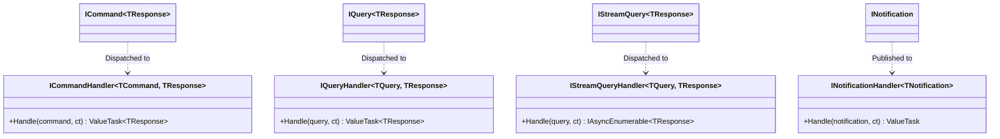

# EricksonLopez.Mediator — Showcase Specification & Architectural Reference

> **Official Reference Implementation and Living Architecture Specification**  
> Target: **.NET 10 / C# 14** · Pattern: **Pure In-Process Mediator & CQRS Engine** · Memory Model: **Zero-Allocation / Native AOT**  
> Status: **100% Synchronized with Public API & Runtime Verified**

---

## 1. Solution Architecture & Package Segregation

The `EricksonLopez.Mediator.slnx` solution organizes mediator infrastructure into fine-grained, decoupled packages:

| Project Path | Category | Architectural Responsibility | Target Framework |
|---|---|---|---|
| `src/EricksonLopez.Mediator` | **Core Package** | Main mediator kernel: `ISender`, `IPublisher`, `IMediator`, `ICommand<T>`, `IQuery<T>`, `INotification`, `IStreamQuery<T>`, struct `INext<T>`, and `IPipelineBehavior<TRequest, TResponse>`. | `net8.0;net9.0;net10.0` |
| `src/EricksonLopez.Mediator.Generator` | **Compiler Tooling** | Roslyn Incremental Generator analyzing syntax trees and synthesizing static compile-time dispatch tables. | `netstandard2.0` |
| `src/EricksonLopez.Mediator.FluentValidation` | **Middleware** | Native FluentValidation integration behavior with optional `IResultFactory<TResponse>` pipeline short-circuiting. | `net8.0;net9.0;net10.0` |
| `src/EricksonLopez.Mediator.Polly` | **Resilience** | Microsoft Polly v8 resilience pipeline behavior (`[UseResiliencePipeline]`). | `net8.0;net9.0;net10.0` |
| `src/EricksonLopez.Mediator.OpenTelemetry` | **Observability** | OpenTelemetry activity tracing and meter instrumentation behavior (`ActivitySource`). | `net8.0;net9.0;net10.0` |
| `src/EricksonLopez.Mediator.RateLimiting` | **Middleware** | In-process rate limiting pipeline behavior (`System.Threading.RateLimiting`). | `net8.0;net9.0;net10.0` |
| `src/EricksonLopez.Mediator.Result` | **Integrations** | Bridges `EricksonLopez.Result` functional pattern with automated failure responses. | `net8.0;net9.0;net10.0` |
| `src/EricksonLopez.Mediator.AspNetCore` | **Presentation** | Minimal API route endpoint extensions (`MapCommand`, `MapQuery`). | `net8.0;net9.0;net10.0` |
| `src/EricksonLopez.Mediator.Testing` | **Testing Tools** | Mock continuations (`DelegateNext`), test fixtures, and assertion utilities. | `net8.0;net9.0;net10.0` |
| `samples/EricksonLopez.Mediator.Samples` | **Showcase** | Executable living documentation validating all 13 showcase feature levels. | `net10.0` |
| `benchmarks/EricksonLopez.Mediator.Benchmarks` | **Performance** | BenchmarkDotNet micro-benchmarks comparing latency and allocations against MediatR 12.x. | `net10.0` |

---

## 2. Core Architectural Invariants

### 2.1 CQRS Semantic Separation
Unlike legacy libraries where all messages inherit from a single `IRequest<T>`, `EricksonLopez.Mediator` strictly segregates write intent from read queries:
- `ICommand<TResponse>`: State mutations, transactional commands.
- `IQuery<TResponse>`: Side-effect-free data queries.
- `IStreamQuery<TResponse>`: Reactive asynchronous streams (`IAsyncEnumerable<TResponse>`).
- `INotification`: Multi-subscriber domain events.



### 2.2 Zero-Allocation Struct Continuations
Traditional mediator pipelines allocate `Func<Task<TResponse>>` closures per behavior. `EricksonLopez.Mediator` replaces heap delegates with value-type struct continuations:

```csharp
public interface INext<TResponse>
{
    ValueTask<TResponse> InvokeAsync();
}
```
All pipeline middleware methods use generic struct constraints `where TNext : struct, INext<TResponse>`, resulting in zero heap allocations.
