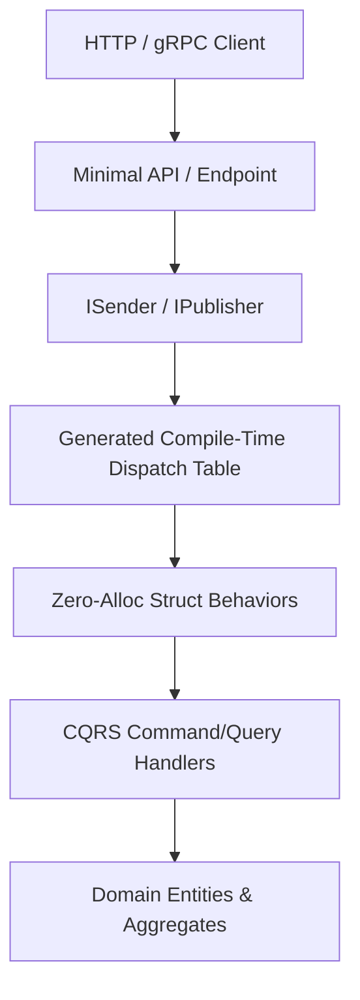

# System Overview & Architecture Summary

## 1. High-Level System Topology

```mermaid
graph TD
    Client[HTTP / gRPC Client] --> Controller[Minimal API / Endpoint]
    Controller --> Sender[ISender / IPublisher]
    Sender --> Table[Generated Compile-Time Dispatch Table]
    Table --> Pipelines[Zero-Alloc Struct Behaviors]
    Pipelines --> Handlers[CQRS Command/Query Handlers]
    Handlers --> Domain[Domain Entities & Aggregates]
```
